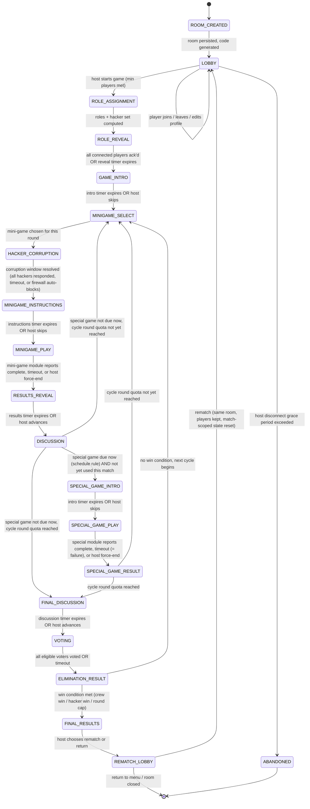

# جاكوم (Jackom) — Core Match Architecture

Foundation design for the state machine, screen flow, and server data model that will host the six regular mini-games and the special seventh game later. **No mini-game mechanics are implemented here** — every mini-game plugs into the loop through one shared interface (`MiniGameModule`, §8).

> **Revision 2.** This revision incorporates a full consistency audit (§13). Every fix described there has been applied inline throughout §1–§12; §13 is the record of what changed and why, plus the implementation-readiness checklist.
>
> **Revision 3.** One further contradiction surfaced while implementing Development Steps 1–2 (shared types + in-memory FSM core) and has been patched inline: `RoundRecord` (§8.5) now persists a `corruptionRevealed` flag alongside `corrupted`, computed once at push time, instead of relying solely on the ephemeral `CurrentRoundState.corruptionRevealed` which disappeared once a round left `currentRound`. See §13.7 for the full write-up. No other architectural changes were made — implementation matched the rest of Revision 2 as designed.

---

## 1. Principles

1. **Server is the only source of truth.** Redis holds one authoritative `RoomState` document per room. Clients never receive `RoomState` directly — they receive derived, role-appropriate **views** built by explicit projection functions (§8.6). Clients hold a read-only mirror of their own view and never mutate it directly.
2. **Clients send intents, never state.** A player action is `{phaseId, seq, actionId, type, payload}`; identity (`playerId`/host) is bound at the WebSocket connection level, never taken from the payload (§1.1). The server decides legality, computes the result, and pushes new views back.
3. **The FSM is a single explicit enum**, transitions are a pure function `(state, event) -> state`, run inside one serialized per-room worker so there's no race between two events transitioning the same room concurrently (concurrency model: §7.1).
4. **Private data never touches a broadcast payload**, enforced structurally: the type that can legally be broadcast (`TvView`, `PlayerView`) has no field capable of holding a role, a corruption choice, or vote content — those types simply don't exist in that shape (§8.6). This is stronger than "remember to strip private fields before sending."
5. **Timers are a start-timestamp + duration, not a ticking counter.** The server owns the deadline and the expiry side-effect; clients just render a local countdown from `phaseStartedAt + durationMs`. The **match clock** (§8.4) is a distinct, separate concept from per-phase timers.
6. **Every mini-game (regular or special) is a plugin**, not a state. The FSM only ever asks a `MiniGameModule` to validate/start/handle-action/resolve; it never inspects or mutates `moduleState` directly, and the module never sees or touches `RoomState` (§8.7).
7. **Nothing is hardcoded that is explicitly "not decided yet"**: hacker count, corruption effect, special-game trigger point, round-per-cycle count, tie-break rule, eliminated-player policy, and AFK thresholds are all config values with a placeholder default (§12). Config values that select an *algorithm* are stored as **rule-id strings**, never as functions — `RoomConfig` must be JSON-serializable to live in Redis (§13, issue #12).

### 1.1 Host vs. Player Session Model (final decision)

Two independent identity/session types exist. They are never conflated:

- **Host session.** Established when a device creates a room (`room:create`). The server issues a `hostSessionToken` bound to `roomId` only — **not** to any `playerId`. The host connects on a distinct channel (e.g. `/host/{roomCode}`, authenticated with `hostSessionToken` at the WebSocket handshake). Every event received on that socket is implicitly authorized as "the host of this room" — no per-message token is needed, and the FSM must never trust a `hostSessionToken` embedded in a message body, only the identity the gateway attached to the socket at connect time.
- **Player session.** Established when a device joins as a player (`room:join`). The server issues a `sessionToken` bound to `{roomId, playerId}`. The player connects on `/play/{roomCode}` authenticated with that token. Same rule: identity is bound at the socket, not read from payloads.

**Default behavior (final):**
- The device that creates the room (the "purchaser"/TV) holds **only** a host session. It is never added to `RoomState.players` and is never counted toward `minPlayers`/`maxPlayers`.
- A human may **separately** join as an ordinary player from their own phone — that is just a normal `room:join`, with no special linkage back to the host session. The system does not need to know or care that the same person is operating both.
- `host:*` actions require an authenticated host socket. `player:*` actions require an authenticated player socket. A single physical device *could* theoretically hold both a host connection and a player connection at once (e.g. a solo tester), but the two are entirely separate sessions/sockets — this is a consequence of the model, not a special case that needs code.
- `PlayerPublic` has **no `isHost` field** — there is no such thing as a player being "the host"; hostness is a session property, not a player property.
- Host reconnection uses `hostSessionToken` and is entirely independent of player reconnection (§9.1). Losing/reconnecting the host never affects any player's `sessionToken` or vice versa.
- Rematch (`REMATCH_LOBBY` → `LOBBY`) keeps both the host session and the player roster intact — neither needs to re-authenticate.

This was previously ambiguous (`hostId: string` looked like a player id, and `PlayerPublic.isHost` implied a host could be a player row). See §13 issue #3 for the full before/after.

---

## 2. Full State Diagram



**Cycle logic:** a match is made of **cycles**. Each cycle runs `roundsPerCycle` (config, placeholder) regular mini-game rounds via the `MINIGAME_SELECT → … → DISCUSSION` loop, then goes to `FINAL_DISCUSSION → VOTING → ELIMINATION_RESULT`. The special seventh game is a **one-time** insertion, decided by `SpecialGameSchedulerConfig` (§8.3), and the "is it due" check runs at **both** `DISCUSSION`'s exit and `SPECIAL_GAME_RESULT`'s exit through one shared decision function, `resolveAfterRoundOrSpecial()` (§9). This is what makes the special game's timing (`between_rounds` / `end_of_cycle` / `fixed_point`) a config concern rather than a structural one — see §3.11/§3.14 and §13 issue #9. After elimination, win/continue logic (embedded in `ELIMINATION_RESULT`'s exit condition, not a separate screen state) decides whether to loop into another cycle or end the match.

---

## 3. State Reference

Each state is specified with: purpose, TV screen, phone screen, allowed player actions, allowed host actions, entry/exit condition, timer behaviour, server events, stored data, and disconnect handling. Terms like "all players" below mean "all players eligible per §3.21," not literally every row in `players`.

### 3.1 `ROOM_CREATED`
- **Purpose:** Allocate a room, generate a join code + QR payload, initialize an empty `RoomState` in Redis, issue the **host session** (§1.1).
- **TV:** Room code + QR code, "waiting for players" placeholder, empty player list.
- **Phone:** N/A (no players yet; this state is host-only).
- **Player actions:** none.
- **Host actions:** regenerate code (rare/admin), cancel room.
- **Entry condition:** A device requests room creation; server issues a `hostSessionToken` for the new `roomId` (not tied to any player).
- **Exit condition:** Immediate, transitions to `LOBBY` once persisted.
- **Timer:** none.
- **Server events emitted:** `room:created` (unicast to the creating host socket, includes `roomCode` + `hostSessionToken`).
- **Data stored:** `roomId`, `roomCode`, `host: HostSession`, `createdAt`, default `config: RoomConfig`.
- **Disconnect handling:** n/a (no players yet; if the creating socket drops before `LOBBY` is reached, the room is simply garbage-collected by Redis TTL — nothing to reconnect to yet).

### 3.2 `LOBBY`
- **Purpose:** Collect players, let them set name/avatar, show live roster, gate on minimum player count.
- **TV:** Room code/QR (still visible), live avatar grid, player count vs. min/max, "Start Game" enabled/disabled indicator.
- **Phone:** Join form (code/QR entry) → name + avatar picker → "waiting for host to start" screen with own avatar shown.
- **Player actions:** `join`, `setProfile` (name/avatar), `leave`.
- **Host actions:** `kickPlayer`, `startGame` (only enabled once `getPlayerCount(room)` is within `[minPlayers, maxPlayers]` and all names/avatars are non-empty/unique), `closeRoom`.
- **Entry condition:** From `ROOM_CREATED`, or looped back from `REMATCH_LOBBY`.
- **Exit condition:** An authenticated host socket sends `host:startGame` and `getPlayerCount(room)` is within `[minPlayers, maxPlayers]`.
- **Timer:** none (lobby is host-paced); optional soft AFK-kick timer per idle player, config placeholder.
- **Server events:** `room:playerJoined`, `room:playerLeft`, `room:playerUpdated`.
- **Data stored:** per player: `playerId`, `sessionToken` (private side only), `name`, `avatarId`, `connectionStatus`, `alive` (defaults `true`), `joinedAt`.
- **Disconnect handling:** Player socket drop → mark `connectionStatus: disconnected`, keep slot reserved for `reconnectGraceMs` (config), then auto-remove from roster if still disconnected. Host disconnect → start `hostGraceMs` countdown shown on TV as "reconnecting…"; if exceeded, room transitions to `ABANDONED`. Host and player disconnect tracking are entirely independent (§1.1).

### 3.3 `ROLE_ASSIGNMENT`
- **Purpose:** Server-only computational state — pick hacker set from the registry-resolved balance rule, assign roles, initialize per-round/per-cycle counters. No meaningful human-facing waiting time.
- **TV:** Transitional "assigning roles…" placeholder (sub-second to a couple seconds).
- **Phone:** Same transitional placeholder.
- **Player actions:** none.
- **Host actions:** none (fully automatic).
- **Entry condition:** From `LOBBY` via `host:startGame`.
- **Exit condition:** Immediate once role computation completes.
- **Timer:** none (or a minimum-display floor timer, e.g. 1500ms, purely cosmetic — placeholder).
- **Server events:** `match:started` (broadcast, no role content).
- **Data stored:** `role` (per player, **private-only**, in `RoomPrivateState`), `cycle = 1`, `roundInCycle = 0`, `firewallActive = false`, `specialGameUsed = false`, `matchClock` initialized per `matchClock.mode` config.
- **Disconnect handling:** n/a (no player input expected).

### 3.4 `ROLE_REVEAL`
- **Purpose:** Privately show each player their role (Crew or Hacker) and, for hackers, who the other hackers are.
- **TV:** Generic "check your phone" prompt, no role content, ambient countdown.
- **Phone:** Full-screen private role card: Crew → "You are Crew, you don't know who else is what"; Hacker → "You are a Hacker" + list of fellow hacker names/avatars.
- **Player actions:** `acknowledgeReveal` (single-submission action, §8.9).
- **Host actions:** `skipRevealTimer` (host-paced skip is allowed here — see the skip-vs-force-end rule in §9.1).
- **Entry condition:** From `ROLE_ASSIGNMENT`.
- **Exit condition:** All connected players have acknowledged, OR reveal timer expires.
- **Timer:** `roleRevealDurationMs` (config placeholder), server-owned.
- **Server events:** `player:privateRoleInfo` (unicast per player only, §8.6), `match:phaseChanged`.
- **Data stored:** `currentPhaseSubmissions` (reused single-submission tracker, §8.9 — this replaces the old ad hoc `ackedPlayerIds`).
- **Disconnect handling:** Disconnected players are excluded from the "all acknowledged" check; they receive `player:privateRoleInfo` again on reconnect.

### 3.5 `GAME_INTRO`
- **Purpose:** Shared narrative/rules framing before the loop starts (placeholder content — copy/art TBD later).
- **TV:** Intro sequence placeholder (skippable by host).
- **Phone:** Passive "watch the TV" screen.
- **Player actions:** none.
- **Host actions:** `skipIntro`.
- **Entry condition:** From `ROLE_REVEAL`.
- **Exit condition:** Timer expires or host skips.
- **Timer:** `introDurationMs` (placeholder).
- **Server events:** `match:phaseChanged`.
- **Data stored:** none new.
- **Disconnect handling:** Purely presentational; no action required.

### 3.6 `MINIGAME_SELECT`
- **Purpose:** Choose which regular mini-game plugin runs this round via the registry-resolved `minigameSelectionRuleId` (random / rotation / no-repeat — the *rule* is a placeholder, §12; the *mechanism* — a rule-id resolved through a server-side registry — is final, §13 issue #12).
- **TV:** "Selecting mini-game…" transition or reveal of the chosen game's title/icon.
- **Phone:** Passive "get ready" screen.
- **Player actions:** none (out of scope now).
- **Host actions:** none in default config; `forceSelectMinigame` (debug/admin override, config-gated).
- **Entry condition:** From `DISCUSSION`/`SPECIAL_GAME_RESULT` (more rounds due) or `ELIMINATION_RESULT` (next cycle).
- **Exit condition:** Selection resolved (near-instant); a fresh `currentRound` (§8.2) is created here.
- **Timer:** none, or a cosmetic reveal delay.
- **Server events:** `match:minigameSelected` (id + display metadata only, no rules yet).
- **Data stored:** `currentRound` created: `minigameId`, `minigameVersion`, `participantIds` (via `getEligibleMinigamePlayers`, §3.21), `roundInCycle += 1`.
- **Disconnect handling:** n/a.

### 3.7 `HACKER_CORRUPTION`
- **Purpose:** Give hackers a private window to decide whether to corrupt the upcoming mini-game. Enforces the Firewall rule server-side. **Resolves the `corrupted` flag but does not reveal it to anyone except (optionally) the hackers themselves.**
- **TV:** Neutral "getting ready…" — indistinguishable from any other brief transition; must **not** hint that a hacker decision is even in progress.
- **Phone (hacker):** Corrupt / Don't corrupt control (exact effect of "corrupt" is mini-game-defined later; this state only captures the *decision*). On submission, the hacker receives a private `player:corruptionAck` unicast confirming receipt (or that the firewall silently blocked it) — never broadcast.
- **Phone (crew):** Passive waiting screen, visually identical to what a hacker's phone shows while *other* hackers are still deciding — a crew player must not be able to distinguish "nothing is happening" from "hackers are deciding."
- **Player actions (hackers only):** `submitCorruptionChoice` (single-submission action).
- **Host actions:** none.
- **Entry condition:** From `MINIGAME_SELECT`.
- **Exit condition:** All hackers submitted, OR timer expires (missing hackers default to `false`), OR `firewallActive === true` (auto-resolves to "blocked," ignoring any hacker input entirely).
- **Timer:** `corruptionWindowMs` (placeholder).
- **Server events:** **`match:phaseChanged` only** — a neutral, content-free transition to `MINIGAME_INSTRUCTIONS`. **No `corrupted` value is broadcast here** (fix for the leak described in §13 issue #4). The authoritative `corrupted` boolean is written to `currentRound.corrupted` (server-side) and handed to the mini-game module via `MiniGameContext.corrupted` when the module's `start()` is called — the module needs it to shape gameplay, the *clients* don't get it until the reveal policy says so.
- **Data stored:** `RoomPrivateState.currentCorruptionChoices` (private, per-hacker, cleared every round), `currentRound.corrupted: boolean` (server-side truth, not yet client-visible), `currentRound.corruptionRevealed: boolean` (starts `false`); if `firewallActive` was consumed this round: `firewallActive = false`, logged to `matchLog`.
- **Disconnect handling:** Disconnected hacker's choice defaults to "no corruption" at timeout — never blocks the round.

**Reveal timing (configurable, §8.3):** `RoomConfig.rules.corruptionRevealPolicy: 'on_results' | 'on_instructions' | 'never'`. **Default placeholder: `'on_results'`** — the `corrupted` flag is first exposed to clients (TV + all players, not just hackers) inside `match:minigameResult` at `RESULTS_REVEAL` entry, never before or during gameplay. `'on_instructions'` and `'never'` exist for future design iteration but are not the default.

### 3.8 `MINIGAME_INSTRUCTIONS`
- **Purpose:** Explain the rules of the selected mini-game before play starts, using the corrupted/default variant the module supplies via `getInstructions(ctx)` — **the instructions themselves may differ when corrupted, but must not visually announce "this round is corrupted"** unless the design later decides that's intentional (out of scope now; default assumption is instructions read the same either way to preserve the reveal-timing guarantee above).
- **TV:** Instruction screen supplied by `module.getInstructions(ctx).default` (or `.corrupted` if defined and `ctx.corrupted`).
- **Phone:** Role-appropriate instruction variant, same source.
- **Player actions:** none (read-only).
- **Host actions:** `skipInstructions`.
- **Entry condition:** From `HACKER_CORRUPTION` (module's `start()` has already been called at this point — see the transition pseudocode in §9).
- **Exit condition:** Timer expires or host skips.
- **Timer:** `instructionsDurationMs` (module-suppliable override via `module.getDurationMs(ctx)` for this phase's variant, else config default).
- **Server events:** `match:phaseChanged`.
- **Data stored:** none new.
- **Disconnect handling:** presentational only.

### 3.9 `MINIGAME_PLAY`
- **Purpose:** Delegate to the active `MiniGameModule` for actual gameplay. The FSM only knows "playing" / "done," not internals, and never mutates `currentRound.moduleState` except by calling module hooks (§8.7, §13 issue #6).
- **TV:** `module.buildTvView(state)` (placeholder generic view for now).
- **Phone:** `module.buildPlayerView(state, playerId, role)` for participants; `module.buildSpectatorView(state)` for non-participants (§3.21).
- **Player actions:** `player:submitAction` (multi-action envelope with `seq`/`actionId` for ordering + retry-dedup, §8.9); validated by `module.validateAction()` before `module.handleAction()` is ever called.
- **Host actions:** `host:forceEndMinigame` escape hatch (counts as `resolve(state, 'forced')`).
- **Entry condition:** From `MINIGAME_INSTRUCTIONS`.
- **Exit condition:** `module.isComplete(state) === true`, OR timeout, OR host force-end.
- **Timer:** `module.getDurationMs(ctx)`, server-owned countdown.
- **Server events:** module-defined intermediate events (namespaced `minigame:*`, still routed through the view builders — a module cannot emit a raw broadcast bypassing redaction), plus `match:minigameCompleted` on exit.
- **Data stored:** `currentRound.moduleState` (live, opaque JSON blob) while playing; on exit, `module.resolve()`'s `{success, scoreDeltas, resultSummary}` is what actually persists into `roundHistory` — the raw `moduleState` is **discarded**, not archived (§13 issue #1).
- **Disconnect handling:** `module.handleDisconnect(state, playerId)` is always called on disconnect; the module decides how a disconnected participant's slot behaves. The FSM guarantees the hook fires, never implements fallback behavior itself.

### 3.10 `RESULTS_REVEAL`
- **Purpose:** Show the outcome of the round (success/fail, corrupted-or-not per the reveal policy, any score deltas) — no elimination/voting yet. **This is the default point where `corrupted` first becomes visible to clients** (§3.7).
- **TV:** Result summary (win/lose banner; "this round was sabotaged: yes/no" if `corruptionRevealPolicy` allows it at this phase — never *who*).
- **Phone:** Personalized result view (e.g., own contribution/score).
- **Player actions:** none.
- **Host actions:** `skipResultsReveal`.
- **Entry condition:** From `MINIGAME_PLAY`.
- **Exit condition:** Timer expires or host advances.
- **Timer:** `resultsDurationMs` (placeholder).
- **Server events:** `match:minigameResult` (sent on entry, includes `corrupted` iff policy says reveal-at-results), `match:phaseChanged` on exit.
- **Data stored:** `currentRound` is cleared (`null`) on exit — the completed record already lives in `roundHistory[]` (written at `MINIGAME_PLAY` exit, §3.9).
- **Disconnect handling:** presentational only.

### 3.11 `DISCUSSION`
- **Purpose:** Open social-deduction talk time between rounds; this is also a **branch point**, evaluated by the shared `resolveAfterRoundOrSpecial()` decision (§9), for: special game now vs. more regular rounds vs. moving to final voting.
- **TV:** Discussion timer, round history recap for the cycle so far.
- **Phone:** Passive screen, possibly a lightweight "suspect notes" scratchpad (local-only, not synced — out of scope to design now).
- **Player actions:** none required by the FSM (any future chat feature is out of scope).
- **Host actions:** `endDiscussionEarly`.
- **Entry condition:** From `RESULTS_REVEAL`.
- **Exit condition (branches, evaluated by `resolveAfterRoundOrSpecial()`):**
  1. `!specialGameUsed AND specialGameScheduleRule(room) === true` → `SPECIAL_GAME_INTRO`. The schedule rule itself decides *whether* "due" can even be true mid-cycle (`insertionPoint: 'between_rounds'`) vs. only once `roundInCycle >= roundsPerCycle` (`insertionPoint: 'end_of_cycle'`) vs. a specific match point (`insertionPoint: 'fixed_point'`) — see §3.14 and §13 issue #9.
  2. else if `roundInCycle < roundsPerCycle` → `MINIGAME_SELECT`.
  3. else → `FINAL_DISCUSSION`.
- **Timer:** `discussionDurationMs` (placeholder).
- **Server events:** `match:phaseChanged` (carries which branch was taken).
- **Data stored:** none new.
- **Disconnect handling:** presentational only.

### 3.12 `SPECIAL_GAME_INTRO`
- **Purpose:** Announce the special seventh-game event and select its participants (3–5 players scaled by lobby size — selection rule itself is a placeholder, §12) from the eligible pool (§3.21).
- **TV:** "Special event!" reveal + selected players' avatars highlighted.
- **Phone (selected):** "You've been chosen" screen.
- **Phone (others):** Spectator/passive screen.
- **Player actions:** none yet (selection is server-driven).
- **Host actions:** `skipSpecialIntro`.
- **Entry condition:** From `DISCUSSION` or `SPECIAL_GAME_RESULT` (in principle — the schedule rule would need `insertionPoint` to allow re-checking after a special round, which the default config does not; see §13 issue #9) whenever the schedule rule fires.
- **Exit condition:** Timer expires or host skips.
- **Timer:** `specialIntroDurationMs` (placeholder).
- **Server events:** `match:specialGameSelected` (participant ids).
- **Data stored:** `currentSpecialRound` created: `participantIds`, `startedAt`; `specialGameUsed = true` (locked immediately on entry so it can never re-trigger this match).
- **Disconnect handling:** if a selected participant is disconnected at selection time, re-roll from the remaining eligible pool per config rule (never select a disconnected player).

### 3.13 `SPECIAL_GAME_PLAY`
- **Purpose:** Delegate to the special-game plugin (`GenericSpecialGameModule` placeholder — same `MiniGameModule` interface as regular mini-games, §8.7).
- **TV/Phone:** `module.buildTvView`/`buildPlayerView`/`buildSpectatorView` (placeholder generic view for now).
- **Player actions:** `player:submitAction`, same envelope as §3.9, restricted to `currentSpecialRound.participantIds` (enforced by `module.validateAction`).
- **Host actions:** `host:forceEndSpecialGame` escape hatch.
- **Entry condition:** From `SPECIAL_GAME_INTRO`.
- **Exit condition:** module reports complete, OR timeout → **counts as failure** (`resolve(state, 'timeout')` with `success: false`, per brief: failure = time penalty), OR host force-end.
- **Timer:** `module.getDurationMs(ctx)`.
- **Server events:** `match:specialGameCompleted`.
- **Data stored:** `currentSpecialRound.moduleState` (live); on exit `module.resolve()`'s result is what persists into `specialRoundHistory`, raw state discarded (same rule as §3.9).
- **Disconnect handling:** a participant disconnecting mid-game triggers `module.handleDisconnect`; module decides if that alone fails the whole special round.

### 3.14 `SPECIAL_GAME_RESULT`
- **Purpose:** Apply the mechanical consequence — success ⇒ set `firewallActive = true` for the next regular round's corruption phase; failure ⇒ apply `specialGame.failPenaltyMs` against `matchClock` (§8.4) **only if `matchClock.mode === 'countdown'`**; if `matchClock.mode === 'disabled'` (the current default), the penalty is logged to `matchLog` for future analytics but has **no gameplay effect** — whether a persistent main match timer exists at all is still an open design question (§12).
- **TV:** Success → "Firewall online" banner; Failure → "-3:00" penalty banner (or a neutral "logged" state if `matchClock.mode === 'disabled'`).
- **Phone:** Same info, personalized only for participants ("you succeeded/failed").
- **Player actions:** none.
- **Host actions:** `advance`.
- **Entry condition:** From `SPECIAL_GAME_PLAY`.
- **Exit condition:** Timer expires or host advances. **Exit routes through the same `resolveAfterRoundOrSpecial()` decision as `DISCUSSION`, minus the special-game check (already consumed this match)** — i.e. `roundInCycle < roundsPerCycle` → `MINIGAME_SELECT`, else → `FINAL_DISCUSSION`. This is what lets the special game land "between rounds" without a special-cased exit (§13 issue #9).
- **Timer:** `specialResultDurationMs` (placeholder).
- **Server events:** `match:firewallActivated` or `match:timePenaltyApplied`.
- **Data stored:** `firewallActive`, `matchClock` adjustment appended to `matchLog[]`; `currentSpecialRound` cleared (`null`) on exit.
- **Disconnect handling:** presentational only.

### 3.15 `FINAL_DISCUSSION`
- **Purpose:** Last discussion window before the cycle's vote — same shape as `DISCUSSION` but always exits to `VOTING` (the special game can never trigger again this match once `specialGameUsed` is `true`, so there's no branch here).
- **TV/Phone:** Same as `DISCUSSION`.
- **Player actions:** none required by FSM.
- **Host actions:** `endDiscussionEarly`.
- **Entry condition:** From `DISCUSSION` (branch 3) or `SPECIAL_GAME_RESULT`.
- **Exit condition:** Timer expires or host advances.
- **Timer:** `finalDiscussionDurationMs` (placeholder, may differ from regular discussion).
- **Server events:** `match:phaseChanged`.
- **Data stored:** none new.
- **Disconnect handling:** presentational only.

### 3.16 `VOTING`
- **Purpose:** Each eligible voter (§3.21) votes to eliminate a suspect (or skip, if allowed by config).
- **TV:** Live "who has voted" progress (not vote content), countdown.
- **Phone (eligible voter):** Vote picker over alive players + optional "skip" option.
- **Phone (ineligible, e.g. eliminated under the default policy):** Spectator screen, vote controls disabled.
- **Player actions:** `submitVote` (single-submission action: target `playerId` or `'skip'`).
- **Host actions:** `endVoteEarly` (forces default `'skip'` votes for stragglers — a deliberate, differently-named action from a generic skip, see §9.1).
- **Entry condition:** From `FINAL_DISCUSSION`.
- **Exit condition:** All eligible voters voted, OR timer expires (non-voters default to `skip`).
- **Timer:** `votingDurationMs` (placeholder).
- **Server events:** `match:voteSubmitted` (progress-only counter, not content, until resolved), `match:voteResult` on exit (full tally).
- **Data stored:** `currentVote.votes: Record<playerId, targetId|'skip'>` for this cycle; on exit, appended to `voteHistory[]` and `currentVote` cleared (`null`).
- **Disconnect handling:** disconnected eligible voter defaults to `skip` at timeout; never blocks the vote closing.

### 3.17 `ELIMINATION_RESULT`
- **Purpose:** Reveal the vote outcome, apply elimination, then evaluate win/continue.
- **TV:** Tally reveal + eliminated player's card (role revealed or not — a placeholder rule, §12) + win/continue banner.
- **Phone:** Same, personalized ("you were eliminated" vs "you're safe").
- **Player actions:** none.
- **Host actions:** `advance`.
- **Entry condition:** From `VOTING`.
- **Exit condition (branches, "Win or Continue Decision"):**
  - Tie handling per `tieBreakRule` config (no-elimination / random / revote — placeholder default, §12).
  - After elimination applied (`players[id].alive = false`), evaluate `checkWinCondition(room, private)`:
    - All hackers eliminated → Crew win → `FINAL_RESULTS`.
    - Hackers ≥ remaining crew (placeholder ratio, §12) → Hacker win → `FINAL_RESULTS`.
    - `cycle >= maxCycles` (config placeholder) → forced end, default winner `'crew'` (placeholder, not a design decision) → `FINAL_RESULTS`.
    - Otherwise → `cycle += 1; roundInCycle = 0` → `MINIGAME_SELECT`.
- **Timer:** `eliminationRevealDurationMs` (placeholder) before auto-advance, or host-advance.
- **Server events:** `match:eliminationResult`, `match:matchEnded` (only if branching to `FINAL_RESULTS`).
- **Data stored:** `eliminatedPlayerId` (this cycle's vote record), updated `players[].alive`, `winner`.
- **Disconnect handling:** presentational only (elimination already computed from stored votes).

### 3.18 `FINAL_RESULTS`
- **Purpose:** Show full match recap — winner, role reveal for everyone, stats.
- **TV:** Full recap screen (placeholder layout).
- **Phone:** Personalized recap ("you were Crew/Hacker, your team won/lost").
- **Player actions:** `requestRematch` (a vote/ack, not a unilateral action).
- **Host actions:** `startRematch`, `returnToMenu`.
- **Entry condition:** From `ELIMINATION_RESULT` win branch.
- **Exit condition:** Host chooses rematch or return.
- **Timer:** none (host-paced).
- **Server events:** `match:finalResults`.
- **Data stored:** full match summary persisted (this is the point where a Postgres write would happen later — out of scope now beyond noting it).
- **Disconnect handling:** no live input required to proceed; host action always available. Host session identity carries through unchanged (§1.1).

### 3.19 `REMATCH_LOBBY`
- **Purpose:** Reset match-scoped state while keeping the room, the **host session**, and the player roster, or close the room.
- **TV:** "Same players, new match?" confirmation / lobby view.
- **Phone:** Same waiting-room view as `LOBBY`.
- **Player actions:** `leave` (opt out of rematch).
- **Host actions:** `startGame` (transitions to `LOBBY`), `closeRoom`.
- **Entry condition:** From `FINAL_RESULTS`.
- **Exit condition:** Host restarts (→ `LOBBY`, all match-scoped fields wiped, roster + room + host session persist) or closes room (→ terminal).
- **Timer:** none.
- **Server events:** `room:reset`, `room:closed`.
- **Data stored:** match-scoped fields cleared (`currentRound`, `currentSpecialRound`, `currentVote`, `roundHistory`, `specialRoundHistory`, `voteHistory`, roles, `cycle`, `firewallActive`, `specialGameUsed`, `matchClock`, `winner`); `roomId`/`roomCode`/`host`/roster retained.
- **Disconnect handling:** same as `LOBBY`.

### 3.20 `ABANDONED` (terminal/error state)
- **Purpose:** Catch-all for unrecoverable room failure (host never returns, room TTL expiry).
- **TV/Phone:** "Session ended" screen.
- **Player/Host actions:** none (room is being torn down); clients redirected to landing/join screen.
- **Entry condition:** Host disconnect grace exceeded in any state, or explicit host `closeRoom`.
- **Exit condition:** Redis key TTL cleanup.
- **Timer:** cleanup TTL only.
- **Server events:** `room:abandoned`.
- **Data stored:** none new — room state expires.
- **Disconnect handling:** n/a.

### 3.21 Cross-Cutting Rule: Eliminated-Player Policy

Elimination affects several states at once, so it is modeled as one config object, `EliminatedPlayerPolicy` (§8.3), consulted wherever "who can act" is computed — never hardcoded per state. This resolves §13 issue #10.

| Capability | Config field | Recommended default | Where it's consulted |
|---|---|---|---|
| Play regular mini-games | `canPlayMinigames` | `false` (spectate only) | `getEligibleMinigamePlayers()` at `MINIGAME_SELECT` |
| Be selected for the special game | `canBeSelectedForSpecialGame` | `false` | `getEligibleSpecialGamePool()` at `SPECIAL_GAME_INTRO` |
| Vote | `canVote` | `false` | eligible-voter check at `VOTING` |
| Show as "active" during discussion | `canDiscuss` | `true` (no chat system yet — cosmetic only) | `DISCUSSION`/`FINAL_DISCUSSION` phone view |
| Keep knowing their own role after elimination | `retainsPrivateRoleVisibility` | `true` — role knowledge is never erased; it was already delivered at `ROLE_REVEAL` and isn't re-sent or revoked | `buildPrivatePlayerView` is simply never called again to "clear" it |

None of these flags require restructuring the FSM to change later — every place that currently says "alive players" or "all players" in earlier drafts has been replaced by a call to the corresponding selector (`getAlivePlayers`, `getEligibleMinigamePlayers`, etc., §8.5), which reads this policy.

---

## 4. Host / TV Screen Flow

```
Landing (Create Room)                                          [host session issued here]
  → Room Code + QR (ROOM_CREATED/LOBBY)
    → Live Lobby Roster (LOBBY)                                [host device is NOT in this roster]
      → Role Assignment Transition (ROLE_ASSIGNMENT)
        → "Check Your Phones" (ROLE_REVEAL)
          → Game Intro (GAME_INTRO)
            → [Regular Round Loop, repeats roundsPerCycle times, special game may interleave — see below]
                → Mini-game Reveal (MINIGAME_SELECT)
                → Neutral "Getting Ready" Wait (HACKER_CORRUPTION)   [no corruption info shown]
                → Instructions (MINIGAME_INSTRUCTIONS)
                → Gameplay View (MINIGAME_PLAY)
                → Results Banner incl. corruption reveal per policy (RESULTS_REVEAL)
                → Discussion Timer (DISCUSSION)                 [branch: special game / next round / final discussion]
            → [Special event, at most once per match, timing per config — may land between any two regular rounds]
                → Special Event Reveal + Participants (SPECIAL_GAME_INTRO)
                → Special Gameplay View (SPECIAL_GAME_PLAY)
                → Firewall/Penalty Banner (SPECIAL_GAME_RESULT)  [branches back into the round loop or onward, same as DISCUSSION]
            → Final Discussion Timer (FINAL_DISCUSSION)
              → Voting Progress (VOTING)
                → Elimination Reveal + Win/Continue Banner (ELIMINATION_RESULT)
                  → [loops back to Mini-game Reveal for next cycle] OR
                  → Final Results Recap (FINAL_RESULTS)
                    → Rematch/Lobby Choice (REMATCH_LOBBY)      [host session persists through rematch]
                      → back to Live Lobby Roster, or Landing
```

## 5. Player Phone Screen Flow

```
Landing (Enter Code / Scan QR)                                  [player session issued on join, separate from any host session]
  → Name + Avatar Picker
    → Waiting Room (mirrors LOBBY roster)
      → Role Transition Placeholder (ROLE_ASSIGNMENT)
        → Private Role Card [Crew | Hacker+accomplices] (ROLE_REVEAL)   [retained even after later elimination, §3.21]
          → Watch-the-TV Intro (GAME_INTRO)
            → [Regular Round Loop]
                → Get Ready (MINIGAME_SELECT)
                → Corruption Choice [hackers only, private] / Passive Wait [everyone else, visually identical] (HACKER_CORRUPTION)
                → Instructions (role-variant) (MINIGAME_INSTRUCTIONS)
                → Private Controller View [participant] or Spectator View [non-participant] (MINIGAME_PLAY)
                → Personal Result incl. corruption reveal per policy (RESULTS_REVEAL)
                → Passive Discussion Screen (DISCUSSION)
            → [If selected, per eligibility policy] Special Game Notice → Controller/Spectator View → Personal Outcome
            → Passive Final Discussion Screen (FINAL_DISCUSSION)
              → Vote Picker [eligible voters] / Disabled [ineligible, e.g. eliminated] (VOTING)
                → Personal Elimination Outcome + Win/Continue Banner (ELIMINATION_RESULT)
                  → [loop] OR → Personal Recap (FINAL_RESULTS)
                    → Waiting Room again, or back to Landing
```

---

## 6. WebSocket Event Catalog

Identity (`playerId` or "is host") is established once at connection time (§1.1) and is never re-derived from a message body; the columns below show *logical* payload contents, not literal wire fields for identity.

### Client → Server (intents)

| Event | Payload (shape) | Valid states | Idempotency class |
|---|---|---|---|
| `host:createRoom` | `{ }` | pre-room | n/a |
| `player:join` | `{ roomCode, name, avatarId }` | `LOBBY` | n/a (join, not a phase action) |
| `player:reconnect` | `{ sessionToken }` | any | n/a |
| `host:reconnect` | `{ hostSessionToken }` | any | n/a |
| `player:setProfile` | `{ name, avatarId }` | `LOBBY` | last-write-wins |
| `player:leave` | `{}` | `LOBBY`, `REMATCH_LOBBY` | n/a |
| `host:startGame` | `{}` | `LOBBY` | n/a |
| `host:kickPlayer` | `{ targetPlayerId }` | `LOBBY` | n/a |
| `player:acknowledgeReveal` | `{ phaseId }` | `ROLE_REVEAL` | single-submission |
| `host:skipIntro` / `host:skipInstructions` / `host:skipRevealTimer` / `host:skipResultsReveal` / `host:skipSpecialIntro` | `{ phaseId }` | their respective host-paced phases only (§9.1) | n/a |
| `player:submitCorruptionChoice` | `{ phaseId, corrupt: boolean }` | `HACKER_CORRUPTION`, hackers only | single-submission |
| `player:submitAction` | `{ phaseId, seq: number, actionId: string, type, data }` | `MINIGAME_PLAY`, `SPECIAL_GAME_PLAY`, participants only | multi-action, ordered (§8.9) |
| `player:submitVote` | `{ phaseId, targetPlayerId \| 'skip' }` | `VOTING`, eligible voters only | single-submission |
| `host:forceEndMinigame` / `host:forceEndSpecialGame` | `{ phaseId }` | `MINIGAME_PLAY` / `SPECIAL_GAME_PLAY` | n/a (explicit force-end, distinct from skip — §9.1) |
| `host:endDiscussionEarly` | `{ phaseId }` | `DISCUSSION` / `FINAL_DISCUSSION` | n/a |
| `host:endVoteEarly` | `{ phaseId }` | `VOTING` | n/a |
| `host:advance` | `{ phaseId }` | host-advance phases (`SPECIAL_GAME_RESULT`, `ELIMINATION_RESULT`, etc.) | n/a |
| `host:restartMatch` | `{}` | `FINAL_RESULTS`, `REMATCH_LOBBY` | n/a |
| `host:closeRoom` | `{}` | any | n/a |
| `player:requestRematch` | `{}` | `FINAL_RESULTS` | single-submission |
| `player:heartbeat` / `host:heartbeat` | `{ clientTime }` (clock-offset + liveness) | any | n/a |

### Server → Client (broadcast or unicast)

| Event | Scope | Notes |
|---|---|---|
| `view:tv` | unicast to host socket | `TvView` projection (§8.6), sent on every transition/relevant mutation — **replaces** the old "broadcast raw `room:state`" idea |
| `view:player` | unicast per player socket | `PlayerView` projection (§8.6), personalized per recipient (participant vs spectator, alive vs eliminated) |
| `player:privateRoleInfo` | unicast | `PrivatePlayerPayload` (§8.6) — role + fellow-hacker ids; sent once at `ROLE_REVEAL` and again only on reconnect, never rebroadcast to anyone else |
| `room:playerJoined` / `room:playerLeft` / `room:playerUpdated` | broadcast (folded into next `view:tv`/`view:player`) | roster changes |
| `room:playerStatusChanged` | broadcast (folded into views) | connected / disconnected / afk |
| `match:phaseChanged` | broadcast (folded into views) | `{ state, phaseId, phaseStartedAt, durationMs }` — **never** carries `corrupted` |
| `match:minigameSelected` | broadcast | id + display metadata only |
| `player:corruptionAck` | **unicast, hackers only** | `{ received: true }` or `{ blockedByFirewall: true }` — confirms *their own* submission only, never anyone else's, never broadcast (fix for §13 issue #4) |
| `match:minigameResult` | broadcast (+ personalized fields unicast) | includes `corrupted` **only if** `corruptionRevealPolicy` says reveal-by-now |
| `match:specialGameSelected` | broadcast | participant ids |
| `match:firewallActivated` / `match:timePenaltyApplied` | broadcast | |
| `match:voteSubmitted` | broadcast | progress counter only, not content |
| `match:voteResult` | broadcast | full tally, sent only at `VOTING` exit |
| `match:eliminationResult` | broadcast | |
| `match:finalResults` | broadcast | |
| `match:matchEnded` | broadcast | |
| `error:actionRejected` | unicast | `{ code, message, phaseId }` — codes include `STALE_PHASE`, `DUPLICATE_ACTION`, `OUT_OF_ORDER`, `NOT_PARTICIPANT`, `INVALID_ACTION`, `MATCH_IN_PROGRESS`, `WRONG_INSTANCE` (§7.1) |
| `host:disconnectedWarning` | broadcast | countdown info for TV |
| `system:hostReassigned` | — | **removed** — host migration is explicitly not implemented (§1.1, §12) |

---

## 7. Live Room-State Structure (Redis)

One JSON document per room at key `room:{roomId}`, split into a public document and a private document so an accidental full-document read/log/dump can never leak roles or votes:

```
room:{roomId}            -> RoomState (JSON)          # no role/vote/corruption-choice content lives here
room:{roomId}:private    -> RoomPrivateState (JSON)    # roles, per-hacker corruption choices, session-token↔playerId map
roomCode:{code}          -> roomId                     (TTL matches room)
session:{sessionToken}   -> { roomId, playerId }       (TTL matches room, refreshed on activity)
hostSession:{token}      -> { roomId }                 (TTL matches room, refreshed on activity — separate namespace from player sessions, §1.1)
```

`RoomState` and `RoomPrivateState` are **server-internal persistence documents** — they are written to Redis for durability/recovery, but **no code path serializes either of them directly onto the wire**. Every outbound payload is one of the explicit projections in §8.6 (`TvView`, `PlayerView`, `PrivatePlayerPayload`), built fresh at send time. This is the resolution to §13 issue #5 — private/public separation is enforced by "there is no function that turns `RoomState` into wire bytes," not by a redaction step that could be forgotten.

### 7.1 Concurrency Strategy

**MVP (final decision for the first implementation):** a single Node process owns every room in memory. Each `roomId` has exactly one in-memory **room actor** — an async queue that processes inbound events strictly one at a time (no distributed lock needed, because there is exactly one process and exactly one queue per room). Redis is used purely for **persistence and crash recovery**, not for coordinating concurrent writers — there are none, by construction, at this stage. On process restart, each room actor rehydrates from `room:{roomId}` / `room:{roomId}:private` and resumes; `stateVersion` is used as a sanity check (if the rehydrated version doesn't match what was last written, log and proceed from the persisted copy — it is authoritative by definition since the process just restarted).

This means: **do not build a distributed Redis lock (e.g. Redlock) for the first implementation.** It solves a problem (multiple processes racing to mutate the same room) that does not exist yet in a single-process deployment, and adds latency + failure modes for no benefit at this stage.

**Scalable alternative (documented for later, not built now):** once the server needs to run as multiple instances (horizontal scaling), the room actor model is preserved by adding **sticky room-to-instance routing** — a directory (e.g. `roomInstance:{roomId} -> instanceId` in Redis) assigns each room to exactly one instance, and the WebSocket gateway layer (load balancer or a thin routing proxy) ensures every socket for a given `roomId` connects to that instance; a socket that lands on the wrong instance is rejected/redirected (`error:actionRejected` code `WRONG_INSTANCE`, or an HTTP redirect before the WS upgrade) rather than allowed to process events locally. This preserves "exactly one in-memory queue per room" without ever taking a distributed lock per event, which is why it's the recommended path over Redlock-style locking: sticky routing keeps the actor model's single-writer guarantee, whereas a distributed lock would keep the single-writer guarantee too but at the cost of a network round-trip on every single event. Reconnection under this model: if a client's WebSocket reconnects to a *different* instance than the one currently owning its room (e.g. after a load balancer failover), that instance looks up `roomInstance:{roomId}` and either proxies the socket to the owning instance or responds with a redirect — it must never silently start a second in-memory actor for the same room.

---

## 8. TypeScript Interfaces

This section is a full rewrite of the original §8 to fix: missing active-round state (§13 issue #1), invalid `Record` usage (§13 issue #2), the host/player session split (§13 issue #3, §1.1), function-valued config that can't survive JSON serialization (§13 issue #12), the `MiniGameModule` boundary (§13 issue #6), two-tier idempotency (§13 issue #7), and the match clock (§13 issue #8).

### 8.1 Enums & Primitives

```typescript
export type GameState =
  | 'ROOM_CREATED'
  | 'LOBBY'
  | 'ROLE_ASSIGNMENT'
  | 'ROLE_REVEAL'
  | 'GAME_INTRO'
  | 'MINIGAME_SELECT'
  | 'HACKER_CORRUPTION'
  | 'MINIGAME_INSTRUCTIONS'
  | 'MINIGAME_PLAY'
  | 'RESULTS_REVEAL'
  | 'DISCUSSION'
  | 'SPECIAL_GAME_INTRO'
  | 'SPECIAL_GAME_PLAY'
  | 'SPECIAL_GAME_RESULT'
  | 'FINAL_DISCUSSION'
  | 'VOTING'
  | 'ELIMINATION_RESULT'
  | 'FINAL_RESULTS'
  | 'REMATCH_LOBBY'
  | 'ABANDONED';

export type Role = 'CREW' | 'HACKER';
export type ConnectionStatus = 'connected' | 'disconnected' | 'afk';
export type Winner = 'crew' | 'hackers' | null;

// Every piece of state that lives in Redis or crosses the wire must be expressible as JsonValue —
// this is what makes "no function-valued config" (§13 issue #12) and "no arbitrary `unknown` to clients" (§13 issue #6) enforceable by the type system.
export type JsonValue =
  | string
  | number
  | boolean
  | null
  | JsonValue[]
  | { [key: string]: JsonValue };
```

### 8.2 Config (serializable — rule *identifiers*, not functions)

```typescript
export interface RoleBalanceConfig {
  roleBalanceRuleId: string;     // resolved server-side via roleBalanceRegistry — see §8.8
  minHackers: number;
  maxHackers: number;
}

export interface SpecialGameSchedulerConfig {
  specialGameScheduleRuleId: string;      // resolves WHEN it's due — via specialGameScheduleRegistry
  specialGameParticipantRuleId: string;   // resolves WHO/how many — via specialGameParticipantRegistry
  insertionPoint: 'between_rounds' | 'end_of_cycle' | 'fixed_point'; // documents intent; the rule itself enforces it (§13 issue #9)
  minParticipants: number;
  maxParticipants: number;
  failPenaltyMs: number;   // placeholder default 180_000 (3 min) per brief
}

export interface MinigameSelectionConfig {
  minigameSelectionRuleId: string; // resolved via minigameSelectionRegistry — random / rotation / no-repeat, all unset (§12)
}

export interface TimerConfig {
  roleRevealDurationMs: number;
  introDurationMs: number;
  corruptionWindowMs: number;
  instructionsDurationMs: number;
  resultsDurationMs: number;
  discussionDurationMs: number;
  finalDiscussionDurationMs: number;
  votingDurationMs: number;
  eliminationRevealDurationMs: number;
  specialIntroDurationMs: number;
  specialResultDurationMs: number;
}

export interface EliminatedPlayerPolicy {
  canPlayMinigames: boolean;              // default false — see §3.21
  canBeSelectedForSpecialGame: boolean;   // default false
  canVote: boolean;                       // default false
  canDiscuss: boolean;                    // default true (cosmetic only, no chat system yet)
  retainsPrivateRoleVisibility: boolean;  // default true — role knowledge is never revoked
}

export interface MatchRulesConfig {
  minPlayers: number;
  maxPlayers: number;
  roundsPerCycle: number;
  maxCycles: number;
  tieBreakRule: 'no_elimination' | 'random' | 'revote';
  corruptionRevealPolicy: 'on_results' | 'on_instructions' | 'never'; // default 'on_results', §3.7
  reconnectGraceMs: number;
  hostGraceMs: number;
  afkThresholdMs: number;
}

export interface RoomConfig {
  roleBalance: RoleBalanceConfig;
  specialGame: SpecialGameSchedulerConfig;
  minigameSelection: MinigameSelectionConfig;
  eliminatedPlayerPolicy: EliminatedPlayerPolicy;
  timers: TimerConfig;
  rules: MatchRulesConfig;
}
```

### 8.3 Sessions (host vs. player — §1.1)

```typescript
/** Server-internal. Never serialized to a client. */
export interface HostSession {
  hostSessionToken: string;   // bound to roomId ONLY, never to a playerId
  connectionStatus: ConnectionStatus;
  connectedAt: number;
  lastSeenAt: number;
}

export interface PlayerPublic {
  playerId: string;
  name: string;
  avatarId: string;
  alive: boolean;
  connectionStatus: ConnectionStatus;
  joinedAt: number;
  // NOTE: intentionally no `isHost` — hostness is a session property, not a player property (§1.1).
}

/** Server-only. Never serialized into any client-facing payload. */
export interface PlayerPrivate {
  playerId: string;
  sessionToken: string;       // bound to { roomId, playerId }
  role: Role | null;
  lastSeenAt: number;
}
```

### 8.4 Match Clock (distinct from per-phase timers — §13 issue #8)

```typescript
export interface MatchClock {
  mode: 'disabled' | 'countdown';  // default 'disabled' until game design decides a main timer exists at all
  startedAt: number | null;
  durationMs: number | null;
  penaltyMs: number;               // accumulated penalty applied so far, for display/audit
  pausedAt: number | null;         // non-null while paused; final pause/resume semantics are undecided (§12)
}

export interface MatchLogEntry {
  at: number;
  type: 'penalty_applied' | 'firewall_activated' | 'firewall_consumed' | 'special_game_result' | string;
  detail: JsonValue;
}
```

### 8.5 Active-round state, separated from history (§13 issue #1)

`roundHistory` / `specialRoundHistory` / `voteHistory` contain **completed records only**. Whatever is currently in progress lives in its own top-level, nullable field (`currentRound`, `currentSpecialRound`, `currentVote`) — this is the fix for the pseudocode referencing `roundHistory.currentDraft`, `moduleState`, and `currentVotes` as if they were already-defined fields.

```typescript
export interface CurrentRoundState {
  cycle: number;
  roundInCycle: number;
  minigameId: string;
  minigameVersion: string;
  participantIds: string[];
  corrupted: boolean;              // authoritative; server-private until corruptionRevealPolicy says otherwise
  corruptionRevealed: boolean;
  moduleState: JsonValue;          // opaque to the FSM, owned by MiniGameModule.start()/handleAction()
  lastSeq: Record<string, number>;          // playerId -> highest accepted seq, for ordering (§8.9)
  recentActionIds: Record<string, string[]>; // playerId -> bounded ring buffer of actionIds, for retry dedup (§8.9)
  startedAt: number;
}

export interface CurrentSpecialRoundState {
  cycle: number;
  participantIds: string[];
  moduleState: JsonValue;
  lastSeq: Record<string, number>;
  recentActionIds: Record<string, string[]>;
  startedAt: number;
}

export interface CurrentVoteState {
  cycle: number;
  votes: Record<string /* voterId */, string /* targetId | 'skip' */>;
  startedAt: number;
}

// ---- Completed history (append-only, never mutated after push) ----

export interface RoundRecord {
  cycle: number;
  roundInCycle: number;
  minigameId: string;
  minigameVersion: string;
  corrupted: boolean;
  /**
   * Whether `corrupted` may be exposed by a view builder for THIS round, computed once (from
   * `corruptionRevealPolicy`) at the moment the record is pushed and persisted here permanently —
   * NOT just on the ephemeral `CurrentRoundState.corruptionRevealed`, which disappears once
   * `currentRound` is cleared at `RESULTS_REVEAL` exit. Without this field, a view built during
   * `DISCUSSION` (or any later recap) reading straight from `roundHistory` would either have no way
   * to know if reveal was allowed for a past round, or — if it naively trusted `corrupted` directly
   * — would leak it retroactively even under `corruptionRevealPolicy: 'never'`. Found during the
   * Step 1/2 implementation pass; see §13 Revision 3 note.
   */
  corruptionRevealed: boolean;
  success: boolean;
  scoreDeltas: Record<string, number>;
  resultSummary: JsonValue;   // module-defined, safe to persist/display — NOT the raw internal moduleState
  startedAt: number;
  endedAt: number;
}

export interface SpecialRoundRecord {
  cycle: number;
  participantIds: string[];
  success: boolean;
  scoreDeltas: Record<string, number>;
  resultSummary: JsonValue;
  startedAt: number;
  endedAt: number;
}

export interface VoteRecord {
  cycle: number;
  votes: Record<string, string>;
  eliminatedPlayerId: string | null;
  tie: boolean;
}

export interface PhaseInfo {
  state: GameState;
  phaseId: string;           // unique per phase entry, used for staleness checks
  phaseStartedAt: number;     // epoch ms, server clock
  durationMs: number | null;  // null = host-paced, no auto-expiry
}
```

### 8.6 Root state, private state, and client-facing view projections

```typescript
export interface RoomState {
  roomId: string;
  roomCode: string;
  host: HostSession;
  config: RoomConfig;

  players: Record<string, PlayerPublic>;   // NEVER call `.length` on this — use the selectors in §8.5b
  phase: PhaseInfo;

  cycle: number;
  roundInCycle: number;
  firewallActive: boolean;
  specialGameUsed: boolean;
  winner: Winner;

  matchClock: MatchClock;

  currentRound: CurrentRoundState | null;
  currentSpecialRound: CurrentSpecialRoundState | null;
  currentVote: CurrentVoteState | null;

  currentPhaseSubmissions: Record<string, boolean>; // playerId -> submitted for THIS phaseId; reset on every transition() — unifies the old ackedPlayerIds / vote-tracking / corruption-tracking into one mechanism (§13 issue #1)

  roundHistory: RoundRecord[];
  specialRoundHistory: SpecialRoundRecord[];
  voteHistory: VoteRecord[];
  matchLog: MatchLogEntry[];

  stateVersion: number;   // incremented every transition(); used as a sanity check on Redis rehydration (§7.1), NOT as a distributed-lock mechanism
  createdAt: number;
  updatedAt: number;
}

/** Server-only. Never serialized into any client-facing payload, never logged wholesale. */
export interface RoomPrivateState {
  roomId: string;
  players: Record<string, PlayerPrivate>;
  currentCorruptionChoices: Record<string /* hackerId */, boolean>; // cleared every round
}

// ---- Explicit client-facing projections (§13 issue #5) ----
// These are the ONLY types that may ever be serialized onto a socket. There is no function anywhere
// in the system whose signature accepts a RoomState/RoomPrivateState and returns "the same thing minus
// some fields" — every projection is its own hand-declared shape, built fresh from RoomState + RoomPrivateState.

export interface PublicPlayerSummary {
  playerId: string;
  name: string;
  avatarId: string;
  alive: boolean;
  connectionStatus: ConnectionStatus;
}

export interface TvView {
  roomCode: string;
  phase: PhaseInfo;
  players: PublicPlayerSummary[];
  cycle: number;
  roundInCycle: number;
  firewallActive: boolean;
  matchClock: MatchClock;
  currentMinigame: { minigameId: string; tvView: JsonValue } | null;             // tvView from module.buildTvView()
  currentSpecialGame: { participantIds: string[]; tvView: JsonValue } | null;
  votingProgress: { votedCount: number; totalEligible: number } | null;         // counts only, never vote content
  lastRoundResult: { minigameId: string; success: boolean; corrupted: boolean } | null; // corrupted omitted (undefined) until corruptionRevealPolicy allows it
  winner: Winner;
}

export interface PlayerView {
  playerId: string;
  self: PublicPlayerSummary;
  others: PublicPlayerSummary[];
  phase: PhaseInfo;
  isParticipantThisRound: boolean;
  minigameView: JsonValue | null;   // module.buildPlayerView() if participant, module.buildSpectatorView() otherwise
  canVote: boolean;
  canAct: boolean;
  lastRoundResult: { minigameId: string; success: boolean; corrupted: boolean } | null;
}

/** Unicast ONLY to the owning player's own socket. Never rebroadcast, never included in TvView/PlayerView. */
export interface PrivatePlayerPayload {
  playerId: string;
  role: Role;
  fellowHackerIds: string[]; // populated only if role === 'HACKER'
}
```

**What each recipient actually receives, concretely:**

| Recipient | Gets | Never gets |
|---|---|---|
| TV / host socket | `TvView` | any `role`, any `RoomPrivateState.currentCorruptionChoices`, vote content, un-revealed `corrupted` |
| Crew player (alive) | `PlayerView` + their own `PrivatePlayerPayload` (role only, cached from `ROLE_REVEAL`) | other players' roles, un-revealed `corrupted`, other players' votes |
| Hacker (alive) | `PlayerView` + `PrivatePlayerPayload` (role + `fellowHackerIds`) + private `player:corruptionAck` | crew players' non-existent "role" content (crew have no secret to leak), other hackers' individual votes |
| Eliminated player | `PlayerView` (with `canVote`/`canAct` reflecting `EliminatedPlayerPolicy`, `minigameView` from `buildSpectatorView`) | nothing removed from what they already knew — retains their own `PrivatePlayerPayload` from before elimination (§3.21) |

### 8.5b Selectors (§13 issue #2 — `players` is a `Record`, never call `.length`/array methods on it directly)

```typescript
export function getAllPlayers(room: RoomState): PlayerPublic[] {
  return Object.values(room.players);
}
export function getPlayerCount(room: RoomState): number {
  return Object.keys(room.players).length;
}
export function getAlivePlayers(room: RoomState): PlayerPublic[] {
  return getAllPlayers(room).filter(p => p.alive);
}
export function getConnectedPlayers(room: RoomState): PlayerPublic[] {
  return getAllPlayers(room).filter(p => p.connectionStatus !== 'disconnected');
}
export function getEligibleMinigamePlayers(room: RoomState): PlayerPublic[] {
  return room.config.eliminatedPlayerPolicy.canPlayMinigames ? getAllPlayers(room) : getAlivePlayers(room);
}
export function getEligibleSpecialGamePool(room: RoomState): PlayerPublic[] {
  return room.config.eliminatedPlayerPolicy.canBeSelectedForSpecialGame ? getAllPlayers(room) : getAlivePlayers(room);
}
export function getEligibleVoters(room: RoomState): PlayerPublic[] {
  return room.config.eliminatedPlayerPolicy.canVote ? getAllPlayers(room) : getAlivePlayers(room);
}
```

### 8.7 Shared mini-game plugin interface (regular AND special games — §13 issue #6)

The module owns only its own `TState`; it never receives or returns `RoomState`, and it never produces a raw payload that bypasses the view builders above — `buildTvView`/`buildPlayerView`/`buildSpectatorView` return `JsonValue`, which the FSM embeds into `TvView.currentMinigame.tvView` / `PlayerView.minigameView` verbatim.

```typescript
export interface MiniGameContext {
  roomId: string;
  minigameId: string;
  participantIds: string[]; // eligible participants for regular games, selected subset for the special game
  corrupted: boolean;       // always false for the special game; server-computed, module-visible, NOT client-visible until reveal policy allows
  config: JsonValue;        // module-specific config, opaque to the FSM
}

export interface MiniGameActionValidation {
  valid: boolean;
  reason?: string; // human-readable, surfaced via error:actionRejected when invalid
}

export interface MiniGameResolution {
  success: boolean;
  scoreDeltas: Record<string, number>;
  resultSummary: JsonValue; // what actually gets persisted into RoundRecord/SpecialRoundRecord — NOT the raw moduleState
}

export interface MiniGameInstructions {
  default: JsonValue;
  corrupted?: JsonValue; // shown instead of default when ctx.corrupted === true, only if the module defines a distinct variant
}

export interface MiniGameModule<TState extends JsonValue = JsonValue> {
  id: string;
  version: string; // persisted into RoundRecord.minigameVersion for later analytics/replay

  start(ctx: MiniGameContext): TState;

  // Called BEFORE handleAction on every incoming action — rejects illegal actions (wrong player,
  // malformed payload, not a participant) without ever mutating state. The FSM enforces that this
  // is always called first; a module cannot skip validation by only implementing handleAction.
  validateAction(state: TState, playerId: string, ctx: MiniGameContext, action: JsonValue): MiniGameActionValidation;
  handleAction(state: TState, playerId: string, action: JsonValue): TState;

  isComplete(state: TState): boolean;
  resolve(state: TState, reason: 'completed' | 'timeout' | 'forced'): MiniGameResolution;

  handleDisconnect(state: TState, playerId: string): TState;

  getInstructions(ctx: MiniGameContext): MiniGameInstructions;
  getDurationMs(ctx: MiniGameContext): number;

  buildTvView(state: TState): JsonValue;
  buildPlayerView(state: TState, playerId: string, role: Role): JsonValue;
  buildSpectatorView(state: TState): JsonValue; // for eliminated / non-participant players — never the same payload as buildPlayerView
}

/** Placeholder used until the real special games are designed. Matches the interface shape exactly. */
export const GenericSpecialGameModule: MiniGameModule<{ participantIds: string[] }> = {
  id: 'generic-special-game',
  version: '0.0.0-placeholder',

  start: (ctx) => ({ participantIds: ctx.participantIds }),

  validateAction: () => ({ valid: false, reason: 'not implemented' }),
  handleAction: (state) => state,

  isComplete: () => false, // TODO: replace once a concrete special game exists
  resolve: () => ({ success: false, scoreDeltas: {}, resultSummary: {} }),

  handleDisconnect: (state) => state,

  getInstructions: () => ({ default: { text: 'placeholder' } }),
  getDurationMs: () => 120_000, // placeholder

  buildTvView: () => ({ placeholder: true }),
  buildPlayerView: () => ({ placeholder: true }),
  buildSpectatorView: () => ({ placeholder: true }),
};
```

### 8.8 Server-only rule registries (never serialized — resolved from the rule-id strings in §8.2)

```typescript
// All of these live in server memory only; RoomConfig stores string ids, never these functions themselves (§13 issue #12).

export const roleBalanceRegistry: Record<string, (playerCount: number) => number> = {
  'placeholder-linear': (n) => Math.round(n * 0.25), // TODO: not a final balancing decision, see §12
};

export const specialGameScheduleRegistry: Record<string, (room: RoomState) => boolean> = {
  'placeholder-end-of-cycle-once': (room) =>
    room.roundInCycle >= room.config.rules.roundsPerCycle && !room.specialGameUsed, // TODO: see §12
};

export const specialGameParticipantRegistry: Record<string, (room: RoomState) => number> = {
  'placeholder-fixed-four': () => 4, // TODO: see §12, must stay within [minParticipants, maxParticipants]
};

export const minigameSelectionRegistry: Record<string, (room: RoomState) => string> = {
  'placeholder-random': (room) => pickRandomMinigameId(), // TODO: see §12
};
```

### 8.9 Idempotency — two tiers (§13 issue #7)

```typescript
// Tier 1 — single-submission actions (one accepted value per playerId per phase):
//   acknowledgeReveal, submitCorruptionChoice, submitVote, requestRematch.
// Tracked via RoomState.currentPhaseSubmissions, wiped on every transition().
// A second attempt in the same phase is rejected with error code DUPLICATE_ACTION, not reprocessed.

// Tier 2 — multi-action mini-game inputs (submitAction during MINIGAME_PLAY / SPECIAL_GAME_PLAY):
// Each action carries a per-player monotonically increasing `seq` AND a unique `actionId`.
//   - `actionId` gives exactly-once dedup: if a client retries the exact same action (e.g. no ack
//     received over a flaky connection), the resend carries the SAME actionId — server recognizes it
//     in `recentActionIds[playerId]` and returns the cached acknowledgement without reprocessing.
//   - `seq` gives ordering: if `seq <= lastSeq[playerId]` and the actionId is NOT a known retry, the
//     action is a stale/out-of-order duplicate (e.g. arrived after a later action due to network
//     jitter) and is dropped with error code OUT_OF_ORDER — applying it out of order could corrupt
//     module state that depends on action ordering.
//   - `recentActionIds[playerId]` is a bounded ring buffer (e.g. last 20) — it exists to catch retries,
//     not to be a full audit log; it must never grow unboundedly.
```

---

## 9. State Transition Pseudocode

Fully rewritten to use the corrected field names (§8.5/§8.6), the selectors (§8.5b), the rule registries (§8.8), the two-tier idempotency model (§8.9), the non-leaking corruption flow (§3.7), and the generalized special-game branch (`resolveAfterRoundOrSpecial`, §13 issue #9).

```
function handleEvent(room: RoomState, priv: RoomPrivateState, event: InboundEvent): RoomState {
  assertEventValidForCurrentPhase(room.phase, event)   // phaseId must match room.phase.phaseId, or reject STALE_PHASE

  switch (room.phase.state) {

    case 'LOBBY':
      if (event.type === 'host:startGame') {
        assertSenderIsHost(event)
        const count = getPlayerCount(room)
        assert(count >= room.config.rules.minPlayers && count <= room.config.rules.maxPlayers)
        return transition(room, 'ROLE_ASSIGNMENT')
      }
      // join/leave/setProfile mutate room.players directly, no transition
      return room

    case 'ROLE_ASSIGNMENT': {
      const resolveHackerCount = roleBalanceRegistry[room.config.roleBalance.roleBalanceRuleId]
      const hackerCount = clamp(
        resolveHackerCount(getPlayerCount(room)),
        room.config.roleBalance.minHackers,
        room.config.roleBalance.maxHackers,
      )
      const hackers = randomSubset(getAllPlayers(room), hackerCount)
      assignRoles(priv, hackers)              // written to RoomPrivateState ONLY
      room.cycle = 1
      room.roundInCycle = 0
      room.firewallActive = false
      room.specialGameUsed = false
      room.matchClock = initMatchClock(room.config)
      return transition(room, 'ROLE_REVEAL')
    }

    case 'ROLE_REVEAL':
      if (event.type === 'player:acknowledgeReveal') {
        if (room.currentPhaseSubmissions[event.playerId]) return room  // DUPLICATE_ACTION, silently idempotent
        room.currentPhaseSubmissions[event.playerId] = true
        if (getConnectedPlayers(room).every(p => room.currentPhaseSubmissions[p.playerId])) {
          return transition(room, 'GAME_INTRO')
        }
        return room
      }
      if (event.type === 'timer:expired') return transition(room, 'GAME_INTRO')
      return room

    case 'MINIGAME_SELECT': {
      const selectRule = minigameSelectionRegistry[room.config.minigameSelection.minigameSelectionRuleId]
      const minigameId = selectRule(room)
      const module = minigameRegistry[minigameId]
      room.roundInCycle += 1
      room.currentRound = {
        cycle: room.cycle,
        roundInCycle: room.roundInCycle,
        minigameId,
        minigameVersion: module.version,
        participantIds: getEligibleMinigamePlayers(room).map(p => p.playerId),
        corrupted: false,
        corruptionRevealed: false,
        moduleState: null,
        lastSeq: {},
        recentActionIds: {},
        startedAt: serverNow(),
      }
      return transition(room, 'HACKER_CORRUPTION')
    }

    case 'HACKER_CORRUPTION': {
      const resolveAndStart = () => {
        // 'on_instructions' reveals starting now; 'on_results'/'never' leave this false here —
        // 'on_results' sets it later, at MINIGAME_PLAY exit (see below). Either way this flag is
        // copied onto the permanent RoundRecord at push time, not left to live only on
        // currentRound (§13 Revision 3 note — this is the fix for the persistence gap).
        if (room.config.rules.corruptionRevealPolicy === 'on_instructions') {
          room.currentRound.corruptionRevealed = true
        }
        const ctx = buildMiniGameContext(room)                     // ctx.corrupted = room.currentRound.corrupted
        const module = minigameRegistry[room.currentRound.minigameId]
        room.currentRound.moduleState = module.start(ctx)
        return transition(room, 'MINIGAME_INSTRUCTIONS')           // neutral transition — NO corrupted flag broadcast (§3.7)
      }

      if (room.firewallActive) {
        room.currentRound.corrupted = false
        room.firewallActive = false
        room.matchLog.push({ at: serverNow(), type: 'firewall_consumed', detail: { cycle: room.cycle, roundInCycle: room.roundInCycle } })
        return resolveAndStart()
      }

      if (event.type === 'player:submitCorruptionChoice') {
        assertIsHacker(priv, event.playerId)
        if (room.currentPhaseSubmissions[event.playerId]) return room // DUPLICATE_ACTION
        room.currentPhaseSubmissions[event.playerId] = true
        priv.currentCorruptionChoices[event.playerId] = event.corrupt
        unicastPrivate(event.playerId, 'player:corruptionAck', { received: true }) // hacker-only, never broadcast
        const hackerIds = getHackerIds(priv)
        if (hackerIds.every(id => room.currentPhaseSubmissions[id])) {
          room.currentRound.corrupted = aggregateCorruption(priv.currentCorruptionChoices) // rule TBD, §12
          return resolveAndStart()
        }
        return room
      }

      if (event.type === 'timer:expired') {
        room.currentRound.corrupted = aggregateCorruption(priv.currentCorruptionChoices) // missing hackers default to false
        return resolveAndStart()
      }

      return room
    }

    case 'MINIGAME_PLAY': {
      const module = minigameRegistry[room.currentRound.minigameId]
      const ctx = buildMiniGameContext(room)

      if (event.type === 'player:submitAction') {
        assert(room.currentRound.participantIds.includes(event.playerId)) // else NOT_PARTICIPANT
        const state = room.currentRound
        if ((state.recentActionIds[event.playerId] ?? []).includes(event.actionId)) return room // harmless retry
        if (event.seq <= (state.lastSeq[event.playerId] ?? 0)) return room                        // OUT_OF_ORDER, drop
        const validation = module.validateAction(state.moduleState, event.playerId, ctx, event.data)
        if (!validation.valid) { emitRejection(event, 'INVALID_ACTION', validation.reason); return room }
        state.moduleState = module.handleAction(state.moduleState, event.playerId, event.data)
        state.lastSeq[event.playerId] = event.seq
        pushBounded(state.recentActionIds, event.playerId, event.actionId, 20)
      }

      if (event.type === 'player:disconnected') {
        room.currentRound.moduleState = module.handleDisconnect(room.currentRound.moduleState, event.playerId)
      }

      const done = module.isComplete(room.currentRound.moduleState)
      const timedOut = event.type === 'timer:expired'
      const forced = event.type === 'host:forceEndMinigame'
      if (done || timedOut || forced) {
        const reason = forced ? 'forced' : timedOut ? 'timeout' : 'completed'
        const result = module.resolve(room.currentRound.moduleState, reason)
        if (room.config.rules.corruptionRevealPolicy === 'on_results') {
          room.currentRound.corruptionRevealed = true
        }
        room.roundHistory.push({
          cycle: room.currentRound.cycle,
          roundInCycle: room.currentRound.roundInCycle,
          minigameId: room.currentRound.minigameId,
          minigameVersion: room.currentRound.minigameVersion,
          corrupted: room.currentRound.corrupted,
          corruptionRevealed: room.currentRound.corruptionRevealed, // persists the reveal decision — see RoundRecord note in §8.5
          success: result.success,
          scoreDeltas: result.scoreDeltas,
          resultSummary: result.resultSummary,
          startedAt: room.currentRound.startedAt,
          endedAt: serverNow(),
        })
        return transition(room, 'RESULTS_REVEAL')
      }
      return room
    }

    case 'RESULTS_REVEAL':
      if (event.type !== 'timer:expired' && event.type !== 'host:skipResultsReveal') return room
      room.currentRound = null   // fully captured in roundHistory already, including corruptionRevealed
      return transition(room, 'DISCUSSION')

    case 'DISCUSSION':
      if (event.type !== 'timer:expired' && event.type !== 'host:endDiscussionEarly') return room
      return resolveAfterRoundOrSpecial(room)

    case 'SPECIAL_GAME_INTRO': {
      if (event.type !== 'timer:expired' && event.type !== 'host:skipSpecialIntro') return room
      const module = GenericSpecialGameModule
      const ctx = buildSpecialGameContext(room)
      room.currentSpecialRound.moduleState = module.start(ctx)
      return transition(room, 'SPECIAL_GAME_PLAY')
    }

    case 'SPECIAL_GAME_PLAY': {
      const module = GenericSpecialGameModule
      const ctx = buildSpecialGameContext(room)
      // ... identical seq/actionId/validateAction handling as MINIGAME_PLAY, scoped to currentSpecialRound ...
      const done = module.isComplete(room.currentSpecialRound.moduleState)
      const timedOut = event.type === 'timer:expired'   // timeout counts as failure per brief
      const forced = event.type === 'host:forceEndSpecialGame'
      if (done || timedOut || forced) {
        const reason = forced ? 'forced' : timedOut ? 'timeout' : 'completed'
        const result = module.resolve(room.currentSpecialRound.moduleState, reason)
        room.specialRoundHistory.push({
          cycle: room.currentSpecialRound.cycle,
          participantIds: room.currentSpecialRound.participantIds,
          success: result.success,
          scoreDeltas: result.scoreDeltas,
          resultSummary: result.resultSummary,
          startedAt: room.currentSpecialRound.startedAt,
          endedAt: serverNow(),
        })
        return transition(room, 'SPECIAL_GAME_RESULT')
      }
      return room
    }

    case 'SPECIAL_GAME_RESULT': {
      if (event.type !== 'timer:expired' && event.type !== 'host:advance') return room
      const lastResult = room.specialRoundHistory[room.specialRoundHistory.length - 1]
      if (lastResult.success) {
        room.firewallActive = true
        room.matchLog.push({ at: serverNow(), type: 'firewall_activated', detail: { cycle: room.cycle } })
      } else if (room.matchClock.mode === 'countdown') {
        room.matchClock.durationMs = Math.max(0, room.matchClock.durationMs - room.config.specialGame.failPenaltyMs)
        room.matchClock.penaltyMs += room.config.specialGame.failPenaltyMs
        room.matchLog.push({ at: serverNow(), type: 'penalty_applied', detail: { ms: room.config.specialGame.failPenaltyMs } })
      } else {
        room.matchLog.push({ at: serverNow(), type: 'penalty_applied', detail: { ms: room.config.specialGame.failPenaltyMs, note: 'matchClock disabled, no gameplay effect' } })
      }
      room.currentSpecialRound = null
      return resolveAfterRoundOrSpecial(room)   // SAME decision function as DISCUSSION, minus the special-game check (§13 issue #9)
    }

    // Shared by DISCUSSION and SPECIAL_GAME_RESULT — this single function is what lets the special
    // game be configured to land between rounds, at cycle end, or at a fixed point, without the FSM
    // itself branching differently in more than one place.
    function resolveAfterRoundOrSpecial(room: RoomState): RoomState {
      if (!room.specialGameUsed) {
        const scheduleRule = specialGameScheduleRegistry[room.config.specialGame.specialGameScheduleRuleId]
        if (scheduleRule(room)) {
          const participantRule = specialGameParticipantRegistry[room.config.specialGame.specialGameParticipantRuleId]
          const count = clamp(participantRule(room), room.config.specialGame.minParticipants, room.config.specialGame.maxParticipants)
          const pool = getEligibleSpecialGamePool(room)
          room.currentSpecialRound = {
            cycle: room.cycle,
            participantIds: randomSubset(pool, count).map(p => p.playerId),
            moduleState: null,
            lastSeq: {},
            recentActionIds: {},
            startedAt: serverNow(),
          }
          room.specialGameUsed = true // locked immediately, can never re-trigger this match
          return transition(room, 'SPECIAL_GAME_INTRO')
        }
      }
      if (room.roundInCycle < room.config.rules.roundsPerCycle) {
        return transition(room, 'MINIGAME_SELECT')
      }
      return transition(room, 'FINAL_DISCUSSION')
    }

    case 'FINAL_DISCUSSION':
      if (event.type !== 'timer:expired' && event.type !== 'host:endDiscussionEarly') return room
      return transition(room, 'VOTING')

    case 'VOTING': {
      const eligibleVoters = getEligibleVoters(room)

      if (event.type === 'player:submitVote') {
        assert(eligibleVoters.some(p => p.playerId === event.playerId))
        if (room.currentPhaseSubmissions[event.playerId]) return room // DUPLICATE_ACTION
        room.currentPhaseSubmissions[event.playerId] = true
        room.currentVote.votes[event.playerId] = event.targetPlayerId
      }

      const allVoted = eligibleVoters.every(p => p.playerId in room.currentVote.votes)
      if (allVoted || event.type === 'timer:expired' || event.type === 'host:endVoteEarly') {
        for (const p of eligibleVoters) {
          if (!(p.playerId in room.currentVote.votes)) room.currentVote.votes[p.playerId] = 'skip'
        }
        const result = tally(room.currentVote.votes, room.config.rules.tieBreakRule)
        room.voteHistory.push({ cycle: room.cycle, votes: room.currentVote.votes, eliminatedPlayerId: result.eliminatedPlayerId, tie: result.tie })
        if (result.eliminatedPlayerId) room.players[result.eliminatedPlayerId].alive = false
        room.currentVote = null
        return transition(room, 'ELIMINATION_RESULT')
      }
      return room
    }

    case 'ELIMINATION_RESULT': {
      if (event.type !== 'timer:expired' && event.type !== 'host:advance') return room
      const winner = checkWinCondition(room, priv)
      if (winner) { room.winner = winner; return transition(room, 'FINAL_RESULTS') }
      if (room.cycle >= room.config.rules.maxCycles) {
        room.winner = 'crew' // placeholder default, NOT a design decision — see §12
        return transition(room, 'FINAL_RESULTS')
      }
      room.cycle += 1
      room.roundInCycle = 0
      return transition(room, 'MINIGAME_SELECT')
    }

    // ... FINAL_RESULTS / REMATCH_LOBBY / ABANDONED handlers omitted for brevity, see §3.18-3.20 ...
  }
}

function transition(room: RoomState, next: GameState): RoomState {
  room.phase = {
    state: next,
    phaseId: generatePhaseId(),
    phaseStartedAt: serverNow(),
    durationMs: durationFor(next, room.config),
  }
  room.currentPhaseSubmissions = {}   // reset the single-submission idempotency guard for the new phase
  room.stateVersion += 1
  room.updatedAt = serverNow()
  scheduleTimerExpiry(room.roomId, room.phase)   // cancels any prior pending timeout for this room first
  broadcastViews(room)   // builds + unicasts TvView / PlayerView[] per recipient — NEVER sends raw RoomState (§8.6)
  return room
}
```

---

## 9.1. Reconnection & Error-Handling Rules

- **Identity binding:** a player's or host's identity is established once, at WebSocket handshake time, from `sessionToken`/`hostSessionToken` — never from fields inside a later message. Every handler above receiving `event.playerId` is reading it from the *authenticated socket*, not from `event`'s payload (§1.1).
- **Duplicate action prevention (tier 1 — single-submission):** tracked via `room.currentPhaseSubmissions`, which is wiped on every `transition()`. A repeat of `acknowledgeReveal`/`submitCorruptionChoice`/`submitVote`/`requestRematch` for the same `playerId` within the same phase is rejected (`error:actionRejected`, code `DUPLICATE_ACTION`) without reprocessing.
- **Duplicate/out-of-order prevention (tier 2 — multi-action mini-game inputs):** every `player:submitAction` carries `seq` + `actionId` (§8.9). A replayed `actionId` returns the cached result without reprocessing; a `seq` at or below the last-accepted value for that player (and not a known retry) is dropped as `OUT_OF_ORDER`.
- **Player disconnect:** mark `connectionStatus: disconnected`, keep the `session:{sessionToken}` mapping alive for `reconnectGraceMs`. Their slot is excluded from any "all eligible responded" check so the FSM never stalls. On timer expiry mid-decision, their vote/choice/action defaults per state (`skip` for votes, `false` for corruption, module-defined via `handleDisconnect` for gameplay).
- **Player reconnect:** client sends `player:reconnect{sessionToken}` on the `/play/{roomCode}` channel; server rebinds the new socket to the existing `playerId`, sets `connectionStatus: connected`, and replays: current `view:player`, and — only if a role has been assigned — `player:privateRoleInfo` again (§3.21: this never changes even if the player was since eliminated).
- **Host disconnect/reconnect:** entirely separate flow on `/host/{roomCode}` using `hostSessionToken`, independent of any player's session (§1.1). TV/phone show `host:disconnectedWarning` with a countdown of `hostGraceMs`. Timers already running keep running (the match doesn't silently freeze) unless the current phase is explicitly host-paced (e.g. `LOBBY`, `FINAL_RESULTS`), in which case it holds. If the grace period lapses, room → `ABANDONED`. Host migration to another device/player is **not implemented** — see §1.1 and §12.
- **AFK players:** if a player is connected but unresponsive past `afkThresholdMs` across consecutive phases requiring input, flag `connectionStatus: afk` (visible on TV) — same default-action fallback as disconnected, but the socket stays live so no reconnection flow is needed.
- **Player joining mid-match:** `player:join` is only valid in `LOBBY`/`REMATCH_LOBBY`. A join attempt during any in-progress state is rejected (`error:actionRejected`, code `MATCH_IN_PROGRESS`) and the client is routed to a landing view — no mid-match seat injection in this design.
- **Tie votes:** resolved per `config.rules.tieBreakRule`: `no_elimination` (default placeholder) skips elimination this cycle, `random` picks among tied targets, `revote` re-enters `VOTING` once with only the tied targets eligible (bounded — max 1 revote, falls back to `no_elimination`).
- **Empty/invalid submissions:** any missing input at timer expiry is filled with a safe default (`skip`, `no corruption`, module-defined no-op) before the FSM computes the transition — the FSM's exit condition is time/completeness, never "did everyone submit something meaningful."
- **Timer expiration:** the server schedules exactly one timeout per phase (cancelling the prior one on every `transition()` call) so a slow client can never cause a double-fire; expiry is itself just another event fed through `handleEvent`.
- **Skipping animations safely:** `host:skip*` actions are only valid for phases explicitly marked host-paced/skippable (§3.4, 3.5, 3.8, 3.10, 3.12, 3.14); they cannot skip a phase awaiting authoritative input (`HACKER_CORRUPTION`, `MINIGAME_PLAY`, `SPECIAL_GAME_PLAY`, `VOTING`) — those can only be force-ended via the explicit `host:forceEnd*`/`host:endVoteEarly` actions, a deliberately different action name so it's auditable and can't be triggered by an accidental double-tap on a generic "skip" button.
- **Restarting a match:** `host:restartMatch` is only valid from `FINAL_RESULTS`/`REMATCH_LOBBY` and resets all match-scoped fields (`currentRound`, `currentSpecialRound`, `currentVote`, `roundHistory`, `specialRoundHistory`, `voteHistory`, `matchLog`, roles, `cycle`, `firewallActive`, `specialGameUsed`, `matchClock`, `winner`) while preserving `roomId`, `roomCode`, `host`, and the player roster.
- **Private information leakage:** enforced structurally, not by convention (§8.6) — `TvView`/`PlayerView` (the only types that may cross the wire) have no field capable of holding a role, a corruption choice, or vote content; those only exist in `RoomPrivateState`/`RoomState.currentVote`/`RoomPrivateState.currentCorruptionChoices`, which have no serialization path to a socket at all.
- **Corruption non-leak specifically:** `HACKER_CORRUPTION`'s exit is a content-free `match:phaseChanged`; `currentRound.corrupted` is not readable by any view builder until `corruptionRevealPolicy` flips `corruptionRevealed` to `true` (default: at `RESULTS_REVEAL`, §3.7).
- **Firewall enforcement:** `HACKER_CORRUPTION` checks `room.firewallActive` **before** looking at any submitted choice — a hacker client sending `corrupt: true` while the firewall is active is simply ignored; the server-computed `corrupted` value (always `false` in this case) is what's stored and eventually revealed.

---

## 10. Recommended Folder Structure

```
/apps
  /web                      # Next.js app (host TV + player phone are routes within this)
    /app
      /host/[roomCode]      # TV screen route — connects using hostSessionToken (§1.1)
      /play/[roomCode]      # Player phone route — connects using sessionToken
      /join                 # Landing / code-QR entry
    /components
      /host                 # TV-only presentational components per state, rendering TvView
      /player               # Phone-only presentational components per state, rendering PlayerView
      /shared
    /lib
      /ws-client.ts         # thin socket wrapper, dispatches typed intents, subscribes to view:tv / view:player
      /view-context.tsx     # React context mirroring the client's own TvView/PlayerView (read-only)

  /server                    # Realtime authoritative server
    /src
      /rooms
        room-manager.ts      # create/join/lookup, Redis-backed
        room-actor.ts        # per-room serialized event processor (§7.1 concurrency model)
        room-instance-directory.ts  # roomId -> instance routing, for the scalable multi-instance path (§7.1) — not needed for MVP
      /fsm
        states.ts            # GameState enum + per-state metadata (durations, allowed actions)
        transitions.ts       # handleEvent(), transition(), resolveAfterRoundOrSpecial()
        guards.ts            # assertEventValidForCurrentPhase, assertSenderIsHost, idempotency guards (§8.9)
      /selectors
        players.ts           # getAllPlayers / getAlivePlayers / getConnectedPlayers / getEligible* (§8.5b)
      /views
        build-tv-view.ts     # buildTvView()
        build-player-view.ts # buildPlayerView() / buildPrivatePlayerView()
      /minigames
        minigame-interface.ts   # MiniGameModule type (§8.7)
        registry.ts             # minigameId -> module lookup
        generic-special-game.ts # GenericSpecialGameModule placeholder
      /rules
        role-balance.ts       # roleBalanceRegistry (§8.8)
        special-game-schedule.ts   # specialGameScheduleRegistry / specialGameParticipantRegistry
        minigame-selection.ts # minigameSelectionRegistry
      /voting
        tally.ts             # tie-break rule implementations
      /timers
        timer-scheduler.ts   # per-room timeout scheduling, cancellation
      /ws
        gateway.ts            # socket auth (host vs player, §1.1), event routing
        events.ts             # event name constants + payload types (shared w/ web via a common package)
      /persistence
        redis-client.ts
        room-state-repo.ts        # get/set RoomState
        room-private-state-repo.ts # get/set RoomPrivateState, in its own Redis key (§7)
        match-history-repo.ts     # Postgres writes at FINAL_RESULTS (later)

/packages
  /shared-types               # RoomState-adjacent types, events, MiniGameModule — imported by both web and server (NOT RoomPrivateState — that never leaves /server)
  /config-defaults             # placeholder config values + registry rule-id strings in one place

/prisma
  schema.prisma                # deferred until persistence is actually built (§ note in brief)
```

---

## 11. Development Order

1. **Shared types package** — `GameState`, `RoomState`, view types (`TvView`/`PlayerView`/`PrivatePlayerPayload`), event contracts, `MiniGameModule` interface (§8). `RoomPrivateState` stays server-only, not in the shared package. Nothing else can be built without this being stable first.
2. **In-memory FSM core** (no networking, no Redis) — `transitions.ts` + guards + selectors + the rule registries with placeholder rule bodies, unit-testable in isolation: feed events, assert resulting state/phase/`currentRound`/`currentVote` shape. This is where the state machine's correctness — including the `resolveAfterRoundOrSpecial` branch reuse — gets proven cheaply.
3. **View builders** (`buildTvView`, `buildPlayerView`, `buildPrivatePlayerView`) as pure functions over `RoomState`/`RoomPrivateState` — unit-test that role/vote/corruption content never appears in `TvView`/`PlayerView` output, independent of the network layer.
4. **Redis-backed room store + room actor** — wrap the pure FSM with persistence (`room:{roomId}` + `room:{roomId}:private`, §7) and per-room serialization (single in-memory actor, §7.1 MVP — no distributed lock).
5. **WebSocket gateway** — separate host (`/host/{roomCode}`) and player (`/play/{roomCode}`) connection paths with distinct session tokens (§1.1), event routing into the room actor, view-only outbound.
6. **Timer scheduler** — server-owned countdowns feeding `timer:expired` events back into the actor.
7. **Lobby + role assignment + reveal** end-to-end (host create → players join → start → private role delivered, host never appears in the roster) — first fully playable vertical slice, provable without any mini-game.
8. **Generic mini-game placeholder module** (a no-op module implementing the full §8.7 interface, including `validateAction`/`buildSpectatorView`, that just waits `durationMs` then auto-succeeds) wired through `MINIGAME_SELECT → … → RESULTS_REVEAL` — proves the plugin boundary and the corruption non-leak (§3.7) before any real mini-game exists.
9. **Discussion → Voting → Elimination → Win check** loop, including tie-break, `EliminatedPlayerPolicy`-driven eligibility (§3.21), and cycle looping back to step 8's placeholder.
10. **Generic special-game placeholder** wired through `resolveAfterRoundOrSpecial()`, `firewallActive`/`matchClock` penalty consequence — verify it can be configured to land between rounds vs. at cycle end using the same code path.
11. **Final results + rematch/return loop**, confirming host session and player roster both survive a rematch reset.
12. **Reconnection hardening pass** — disconnect/AFK/host-grace paths, tier-2 idempotency (`seq`/`actionId`) — since these cut across every state and are easiest to verify once the whole loop already runs end-to-end.
13. **TV and phone UI shells** per state (can start in parallel with steps 7–11 once event contracts + view types are frozen in step 1, since UI only needs to render `TvView`/`PlayerView` + dispatch intents).
14. Only after all of the above is stable: begin designing the real six mini-games and the three special-game concepts against the now-proven `MiniGameModule` interface.

---

## 12. Explicit Placeholders (do not treat these as decided)

- **Hacker count formula** (`roleBalanceRegistry['placeholder-linear']`) — the rule-id/registry *mechanism* is final, the actual ratio/table is not.
- **Mini-game selection strategy** (`minigameSelectionRegistry`) — random vs. rotation vs. no-repeat-until-exhausted is unset.
- **Corruption aggregation rule** when there are multiple hackers — "any one hacker corrupts" vs. "majority" vs. "unanimous" is unset (`aggregateCorruption()` is a named stub, not yet in a registry since it's a single small function — promote to a registry if more than one rule is ever needed).
- **Special-game trigger rule** (`specialGameScheduleRegistry`) — whether it's a fixed cycle number, a probability, or tied to elapsed match time is unset; `insertionPoint` documents *intent* but the actual rule body decides *fact*. The brief's "seventh" is treated as the event's *name/brand*, not a hardcoded round index.
- **Whether a persistent main match clock exists at all** (`MatchClock.mode`) — default is `'disabled'`, meaning the special game's fail penalty is currently a no-op logged to `matchLog` only. This is explicitly unresolved, not quietly assumed either way (§13 issue #8).
- **`MatchClock` pause/resume semantics** — the field (`pausedAt`) exists structurally; when/whether the clock ever pauses (e.g. during discussion) is undecided.
- **Special-game participant selection rule** (`specialGameParticipantRegistry`) — count-scaling bounds (`min`/`maxParticipants`) are enforced, the *selection method* (random / role-weighted / exclude-recently-selected) is not.
- **Tie-break rule default** — three options are implemented (`no_elimination`/`random`/`revote`), no default has been chosen as final.
- **Whether eliminated players' roles are revealed publicly** at `ELIMINATION_RESULT` — flagged inline in §3.17, no rule chosen.
- **`EliminatedPlayerPolicy` defaults** — a recommended default is given per flag in §3.21, but none of the five booleans is a locked design decision.
- **Host migration on disconnect** — explicitly *not* implemented; current design pauses/waits for the same host session only (§1.1).
- **AFK auto-kick vs. AFK-tolerate-forever** — threshold exists in config, but whether prolonged AFK ever removes a player from `players` (vs. just tagging status) is unset.
- **Win-condition ratio for hackers** (`checkWinCondition`) — "hackers ≥ remaining crew" is a strawman placeholder pending real balancing.
- **`maxCycles` forced-end default winner** — pseudocode defaults to `'crew'`, purely as a safe placeholder, not a design decision.
- **Corruption reveal policy default** — `'on_results'` is the recommended default (§3.7/§8.2), but is still a placeholder pending playtesting; `'on_instructions'`/`'never'` remain valid alternatives the type already supports.
- **The three special-game concepts themselves** (Blind Escape / Bomb Protocol / The Moving Package) — only the shared `MiniGameModule`-shaped `GenericSpecialGameModule` exists.
- **The six regular mini-games** — only the plugin boundary (`MiniGameModule`, now including `validateAction`/`buildSpectatorView`/instructions variants) exists; no concrete module beyond a no-op placeholder.

---

## 13. Architecture Audit and Resolved Issues

This section records the consistency audit performed against the draft this revision replaces, before any implementation code was written.

### 13.1 Issues found and how each was resolved

| # | Issue | Where it showed up | Resolution |
|---|---|---|---|
| 1 | `RoomState` had no field for the round/vote *currently in progress* — pseudocode referenced `currentRound`, `roundHistory.currentDraft`, `currentVotes`, and a bare `moduleState` that were never declared, and would push half-finished records into arrays meant for completed history. | old §8/§9 | Added `CurrentRoundState`, `CurrentSpecialRoundState`, `CurrentVoteState` as separate nullable top-level fields (§8.5). History arrays (`roundHistory`/`specialRoundHistory`/`voteHistory`) now only ever receive a push of a fully-resolved record, never a mutated draft. |
| 1b | No field tracked processed action ids for idempotency. | old §9.1 (asserted a rule but no backing field existed) | Added `lastSeq`/`recentActionIds` to `CurrentRoundState`/`CurrentSpecialRoundState`, and unified all single-submission tracking (`ackedPlayerIds`, an implied-but-undeclared `currentVotes` object, per-hacker submission tracking) into one `RoomState.currentPhaseSubmissions` field, reset every `transition()` (§8.6, §8.9). |
| 2 | `players: Record<string, PlayerPublic>` but pseudocode called `room.players.length` and iterated it like an array in several places — invalid TypeScript, would not compile. | old §9 (`ROLE_ASSIGNMENT`, `LOBBY`) | Added explicit selectors — `getAllPlayers`, `getAlivePlayers`, `getConnectedPlayers`, `getPlayerCount`, `getEligibleMinigamePlayers`, `getEligibleSpecialGamePool`, `getEligibleVoters` (§8.5b) — and rewrote every pseudocode reference to use them. |
| 3 | `hostId: string` on `RoomState` read like a player id, `PlayerPublic.isHost` implied a player row could also be "the host," and no session model separated the two identity types or their auth. | old §8 (`RoomState.hostId`, `PlayerPublic.isHost`), old §3.2/3.18/3.19 | Introduced a distinct `HostSession` type keyed by `hostSessionToken`, bound to `roomId` only (§1.1, §8.3). Removed `isHost` from `PlayerPublic` entirely. The room-creating device is never added to `players` and never counts toward `minPlayers`/`maxPlayers`; a person may still separately join as an ordinary player from their phone with no special linkage. Host and player reconnection are documented as fully independent flows (§9.1). |
| 4 | `match:corruptionResolved {corrupted: boolean}` was broadcast to everyone — including crew — immediately after `HACKER_CORRUPTION` resolved, telling crew whether the round was sabotaged *before* they played it. This directly undermines the social-deduction premise. | old §3.7, old §6 event catalog | `HACKER_CORRUPTION`'s exit is now a content-free `match:phaseChanged`. `corrupted` lives only in `currentRound.corrupted` (server-side) until `RoomConfig.rules.corruptionRevealPolicy` (default `'on_results'`) allows a view builder to expose it — by default, first visible at `RESULTS_REVEAL`, after gameplay. Hackers get a private, unicast `player:corruptionAck` confirming their own submission was received or firewall-blocked — never broadcast, never reveals other hackers' choices (§3.7, §6, §9.1). |
| 5 | The design said private/public separation was enforced by "the broadcastable object has no field for it," but `RoomState` itself was the thing being broadcast (redacted), which is a claim about discipline, not about types. | old §7, old §9.1 | Split persistence (`RoomState`/`RoomPrivateState`, server-only, never serialized to a socket) from transport (`TvView`/`PlayerView`/`PrivatePlayerPayload`, §8.6) — explicit, independently-declared projection types built fresh at send time. There is no function anywhere with the signature "take `RoomState`, return it minus some fields" — every recipient's shape is hand-declared. A table of exactly what TV / crew / hacker / eliminated player receives is included in §8.6. |
| 6 | `MiniGameModule` let `handleAction`/`resolve` operate on totally opaque `unknown` state with no validation step, no distinct spectator/TV/player views, no instructions variants, and no module version — a module could return arbitrary data straight to clients, and nothing stopped an invalid action from mutating state before being checked. | old §8 `MiniGameModule` | Rewrote the interface (§8.7) to require: `validateAction` (called by the FSM before `handleAction`, always), `buildTvView`/`buildPlayerView`/`buildSpectatorView` (all returning `JsonValue`, embedded into `TvView`/`PlayerView` rather than sent raw), `getInstructions` (default + optional corrupted variant), `version`, and a `reason` argument on `resolve()` distinguishing completed/timeout/forced. `TState` is now bounded by `JsonValue`, so a module literally cannot hold non-serializable state. |
| 7 | The single-submission-per-player-per-phase idempotency rule was stated as blanket policy, but mini-games plausibly need many actions per player per phase (e.g. continuous input) — the rule as written would silently drop all but the first action. | old §9.1 | Split into two tiers (§8.9): single-submission for votes/corruption-choices/acks/rematch-requests (tracked via `currentPhaseSubmissions`), and ordered multi-action for gameplay (`seq` + `actionId` on `player:submitAction`, tracked per-player in `currentRound.lastSeq`/`recentActionIds`, bounded ring buffer). Documented exactly how duplicate, delayed, and out-of-order messages are each handled. |
| 8 | `mainTimerMs` was referenced as an informal adjustment log entry with no declared type, and it was unclear whether a persistent match-wide timer (distinct from per-phase timers) was assumed to exist. | old §3.14, old §8, old §12 | Added `MatchClock` (§8.4) exactly as scoped: `mode: 'disabled' | 'countdown'`, `startedAt`, `durationMs`, `penaltyMs`, `pausedAt`. Default `mode: 'disabled'` — the special game's failure penalty is applied only if `mode === 'countdown'`; otherwise it's logged to `matchLog` with no gameplay effect. Explicitly still a placeholder (§12), but now a real, typed placeholder instead of an implied field. |
| 9 | `SPECIAL_GAME_RESULT` unconditionally exited to `FINAL_DISCUSSION`, which silently hardcoded "the special game always happens at the very end of a cycle" — contradicting the requirement that its timing (between rounds / end of cycle / fixed point) be configurable. | old §2 diagram, old §3.11/§3.14 | Generalized the branch: both `DISCUSSION` and `SPECIAL_GAME_RESULT` now call the same `resolveAfterRoundOrSpecial()` decision function (§9). The special-game "is it due" check runs at every `DISCUSSION` exit (not only at cycle end), and after a special round, the FSM falls through to the identical "more rounds in this cycle vs. final discussion" branch. `SpecialGameSchedulerConfig.insertionPoint` documents which timing mode is intended; the registered rule body is what actually enforces it. No mini-game mechanics were touched to make this work — purely an FSM-branch fix. |
| 10 | Eliminated-player behavior (mini-games, special-game eligibility, voting, retained private info) was undefined, and nothing in the state machine had a hook for it — any future decision would have required touching every state's exit condition individually. | old §3.16/3.17 (informal mentions only) | Added `EliminatedPlayerPolicy` (§8.2) plus the selectors that consult it (§8.5b), documented as one cross-cutting rule (§3.21) rather than scattered per-state logic. Every place that used to say "alive players" or "all players" now calls the corresponding selector. Changing the policy later is a config change, not an FSM change. |
| 11 | The original Redis section vaguely mentioned "a room-level mutex/lock (or a single-threaded actor... or multiple ECS instances)" as if these were interchangeable, without saying which to build first or what happens on cross-instance reconnection. | old §7 | Split into an explicit MVP (§7.1): single process, in-memory room actor per room, Redis for persistence only, no distributed lock. Documented the scalable alternative separately (sticky room→instance routing, preferred over Redlock-style per-event locking) and what a socket reconnecting to the "wrong" instance must do (redirect/proxy via `roomInstance:{roomId}`, never open a second in-memory actor for the same room). |
| 12 | `RoleBalanceConfig.resolveHackerCount`, `SpecialGameSchedulerConfig.isDueThisCycle`/`resolveParticipantCount` were function-valued fields inside types explicitly described as living in `RoomState`/Redis — functions cannot be JSON-serialized, so this could never actually round-trip through Redis as written. | old §8 | Replaced every algorithm-selecting config field with a plain string rule-id (`roleBalanceRuleId`, `specialGameScheduleRuleId`, `specialGameParticipantRuleId`, `minigameSelectionRuleId`), resolved through server-only registries (§8.8) that are never part of `RoomConfig`/`RoomState` and never serialized. `RoomConfig` is now fully expressible as `JsonValue`. |
| — | Naming inconsistency: `ackedPlayerIds` (array), an implied `currentVotes` (object, never declared), and per-hacker submission tracking were three different ad hoc patterns for "who has responded this phase." | old §8/§9 | Unified into one mechanism, `RoomState.currentPhaseSubmissions: Record<playerId, boolean>`, reset on every `transition()` and reused by `ROLE_REVEAL` acks, `HACKER_CORRUPTION` choices, and `VOTING` votes alike (§8.6, §8.9). |
| — | `RoundRecord`/`SpecialRoundRecord` stored the raw `moduleState` in permanent history, which would grow the Redis document unboundedly and expose internal module data with no schema guarantee. | old §8 | History records now store `resultSummary: JsonValue` (module-defined, meant to be small/persistable) instead of the raw `moduleState`; the live `moduleState` is discarded once a round resolves (§8.5, §13.1 row 1). |

### 13.2 Final architectural decisions (not subject to further "TBD")

- Host and player are distinct session types with independent tokens, auth channels, and reconnection flows; the host device is never a player row (§1.1).
- `RoomState`/`RoomPrivateState` never leave the server; only `TvView`/`PlayerView`/`PrivatePlayerPayload` are ever serialized to a socket (§8.6).
- Corruption resolution and identity are computed and stored server-side at `HACKER_CORRUPTION`, but are not exposed to any client until the configured reveal point (default: `RESULTS_REVEAL`) (§3.7).
- All algorithm-selecting config is a rule-id string resolved via a server-only registry — `RoomConfig` is fully JSON-serializable (§8.2, §8.8).
- Active round/vote/special-round state is separate from history; history arrays are append-only and hold only completed, resolved records (§8.5).
- Idempotency is two-tiered: single-submission (`currentPhaseSubmissions`) for votes/acks/corruption-choices, ordered multi-action (`seq`+`actionId`) for mini-game gameplay input (§8.9).
- The special game's due-check and post-result branch share one function, `resolveAfterRoundOrSpecial()`, so its timing is a config/registry concern, not an FSM-structure concern (§9, §13.1 row 9).
- MVP concurrency is a single process with one in-memory actor per room; Redis is persistence-only at this stage. No distributed lock is built until multi-instance scaling is actually needed (§7.1).
- `MiniGameModule` state is bounded by `JsonValue`, must go through `validateAction` before `handleAction`, and only ever exposes itself to clients through `buildTvView`/`buildPlayerView`/`buildSpectatorView` (§8.7).

### 13.3 Recommended defaults (sensible starting points, expected to be tuned, not re-architected)

- `corruptionRevealPolicy: 'on_results'`.
- `matchClock.mode: 'disabled'` (special-game penalty logged only, no gameplay effect until a main timer is designed).
- `EliminatedPlayerPolicy`: cannot play mini-games, cannot be selected for the special game, cannot vote, shows as passively "present" during discussion, retains their own role knowledge forever.
- `tieBreakRule: 'no_elimination'`.
- `maxCycles` forced-end winner: `'crew'`.
- Redis concurrency: single-process in-memory actor (§7.1 MVP), sticky-routing as the scale-out path, Redlock-style locking not recommended even at scale.

### 13.4 Unresolved game-design placeholders (deliberately not decided here — see §12 for the full list)

Hacker-count ratio, mini-game selection strategy, corruption aggregation rule among multiple hackers, special-game schedule rule body and exact `insertionPoint` choice, special-game participant selection method, whether a persistent match clock ships at all, match-clock pause semantics, whether eliminated players' roles are revealed publicly, hacker win-condition ratio, and — obviously — the six regular mini-games and the three special-game concepts themselves.

### 13.5 Implementation-Readiness Checklist

- [x] Every `RoomState` field referenced by pseudocode is declared, with no implicit/undeclared fields (`currentRound`, `currentSpecialRound`, `currentVote`, `currentPhaseSubmissions`, `matchClock`, `matchLog` all present).
- [x] No pseudocode calls an array method on `players` (a `Record`) — all access goes through §8.5b selectors.
- [x] Host and player identity/session are structurally distinct end-to-end (types, tokens, channels, reconnection, folder structure).
- [x] No corruption information reaches any client before the configured reveal point; verified against every event in §6 and every state's client-facing fields in §3.
- [x] Every client-facing payload type is hand-declared (`TvView`/`PlayerView`/`PrivatePlayerPayload`); no function projects `RoomState` "minus some fields."
- [x] `MiniGameModule` cannot mutate `RoomState`, must validate before acting, and cannot return non-JSON or unbounded state to a client.
- [x] Idempotency is defined for both single-submission and multi-action cases, including out-of-order and retry handling.
- [x] Match clock is a typed, separate concept from per-phase timers, with an explicit default (`disabled`) and no assumed gameplay effect beyond that default.
- [x] Special-game timing is a config/registry concern; the FSM has exactly one branch decision for "what happens after a round or a special game," not two divergent ones.
- [x] Eliminated-player behavior is policy-driven and touches no per-state special-casing beyond calling shared selectors.
- [x] Redis concurrency strategy for the first implementation is singular and explicit (no mixed lock/actor/multi-instance ambiguity); the scale-out path is documented separately and doesn't require rewriting the MVP.
- [x] All `RoomConfig` fields are plain data (strings/numbers/booleans) — nothing function-valued needs to survive a Redis round-trip.
- [ ] Concrete values for every item in §13.4 (explicitly out of scope for this pass — game-design decisions, not architecture).

### 13.6 Readiness Statement

**The architecture is ready for Development Step 1** (§11: shared types package) **and Step 2** (in-memory FSM core). Nothing in §13.4's open game-design placeholders blocks either step, since both operate purely on the *shape* of the state machine and its data — every placeholder is consumed through a registry/rule-id indirection that can ship with a stub implementation today and be swapped later without touching the FSM, the view layer, or the folder structure. Steps 3 onward (Redis persistence, WebSocket gateway, UI) can proceed in the order given in §11 without re-opening this audit, unless implementation surfaces a concrete contradiction this review didn't anticipate — in which case it should be logged as a new row in §13.1, not silently patched.

### 13.7 Revision 3 — Contradiction Found During Step 1/2 Implementation

While implementing the shared types package and the in-memory FSM core (this revision's actual code, see `IMPLEMENTATION_PROGRESS.md`), one genuine contradiction surfaced that Revision 2's design review did not catch:

| # | Issue | Where it showed up | Resolution |
|---|---|---|---|
| 13 | `CurrentRoundState.corruptionRevealed` (§8.5) was the only place recording whether a round's `corrupted` flag may be exposed to clients — but it lived on `currentRound`, which is set to `null` the moment `RESULTS_REVEAL` exits (§3.10). Any view built afterward (e.g. a `DISCUSSION` recap, or a later full-match summary) reading the already-completed entry in `roundHistory` had no equivalent flag to consult. A view builder that (reasonably) trusted `RoundRecord.corrupted` directly, without re-deriving the reveal decision from scratch, would leak corruption retroactively for every completed round — including under `corruptionRevealPolicy: 'never'`, which is exactly the leak §13 issue #4 was meant to close. Separately, the `'on_instructions'` policy value was documented as valid (§3.7, §8.2) but never actually wired into any pseudocode branch — only `'on_results'` had a concrete implementation. | `RoundRecord` (§8.5), `MINIGAME_PLAY` exit pseudocode (§9) | Added `corruptionRevealed: boolean` to `RoundRecord` itself, computed **once, at push time**, and persisted permanently alongside the record — not derived from `currentRound` after the fact. The computation now happens at one of two points depending on policy: immediately after `HACKER_CORRUPTION` resolves (for `'on_instructions'`) or immediately before the `roundHistory.push` at `MINIGAME_PLAY` exit (for `'on_results'`); `'never'` never sets it. Both call sites write the SAME field (`currentRound.corruptionRevealed`), which is then copied verbatim into the pushed `RoundRecord`. This also incidentally wires up `'on_instructions'`, which Revision 2 had left as an unimplemented (but documented) option. |

This is the only architectural change made during Step 1/2 implementation — everything else in Revision 2 (host/player session split, view projections, `MiniGameModule` boundary, two-tier idempotency, the `resolveAfterRoundOrSpecial()` branch reuse, the concurrency MVP, rule-id registries) was implemented exactly as designed, with unit tests (`apps/server/test/`) confirming each behavior, and did not require any further doc changes.
